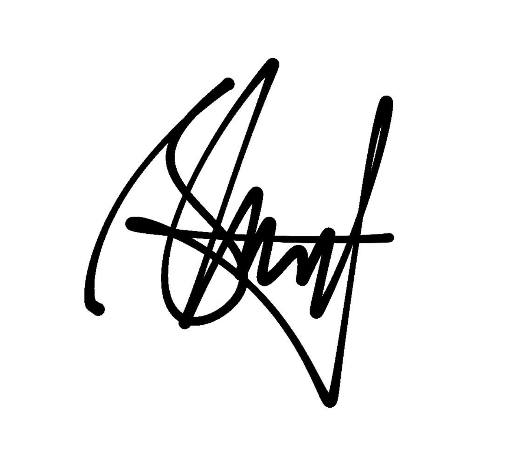

# Deklarasi Penggunaan AI

## Tugas Besar IF2150 - Rekayasa Perangkat Lunak

| Informasi | Keterangan |
|---|---|
| Kelas | *02* |
| Nomor Kelompok | *08* |
| Nama Kelompok | *BS3N* |
| Nama Perangkat Lunak | *KlimPooL* |

**Anggota Kelompok:**

| NIM | Nama |
|---|---|
| 13525023 | Shaquille Nathan Kalevi |
| 13525080 | Neysa Alya Mukhbita |
| 13525092 | Bryan Pamungkas Prahara |
| 13525134 | Sahla Nailah Salsabilla |
| 13525140 | Nayla Putri Ghaisani |

---

### Daftar Isi
* [Milestone 1](#milestone-1)
* Notes: Copy bagian Daftar Isi seperti Milestone 1 untuk Milestone berikutnya, contoh ``* [Milestone 2](#milestone-2)``. Ketika Daftar isi diklik maka akan langsung diarahkan ke bagian bawah sesuai dengan Milestone tujuan.

---

### Log Penggunaan AI per Milestone

Silakan catat penggunaan AI yang berdampak signifikan pada pengerjaan tugas (misal: *generate* fungsi algoritma yang kompleks, *generate* draf dokumen SKPL/DPPL, atau *debugging* error utama). 
*Penggunaan sepele seperti memperbaiki *typo* atau auto-complete satu baris kode tidak perlu dicatat.*

### Milestone 1
| Tool AI | Tujuan Penggunaan | Contoh Prompt Utama | Modifikasi & Validasi Manusia |
| :--- | :--- | :--- | :--- |
| Gemini | Pemilihan data seperti apa yang akan digunakan pada bab 1 | "aku ingin membuat latar belakang dari tugas RPL ku yang akan menyusun suatu aplikasi seperti kitabisa yang mengamalkan/mencari bantuan dengan fitur fitur yang lebih lengkap seperti ada footprint calculator, hingga tidak hanya uang melainkan bantuan fisik/tenaga, aku mengambil sdgs climate action, aku ingin ada 3 paragraf yang dari umum menuju spesifik ke aplikasi ku dengan mengangkat kasus hangat seperti gletser nepal mencair membunuh banyak orang hingga skala nasional kebakaran hutan dan gempa bumi, tuliskan ide/data lain yang dapat saya cantumkan dan darimana sumbernya" | AI memberikan list ide dan data lalu kami cek data dan sumbernya. Kami memastikan data benar-benar ada dan dari sumber terpercaya. | |

### Milestone 2
| Tool AI | Tujuan Penggunaan | Contoh Prompt Utama | Modifikasi & Validasi Manusia |
| :--- | :--- | :--- | :--- |
| | | | | |
| | | | | |

---
### Pernyataan Integritas dan Persetujuan

Kami yang bertanda tangan di bawah ini menyatakan bahwa seluruh log penggunaan AI di atas adalah benar. Kami telah memvalidasi seluruh hasil AI dan bertanggung jawab penuh atas orisinalitas, keamanan, dan kebenaran hasil akhir dari tugas ini.

| Tanda Tangan | Nama Anggota |
| :---: | :--- |
|  | **[13525023 - Shaquille Nathan Kalevi]** |
|  | **[13525080 - Neysa Alya Mukhbita]** |
|  | **[13525092 - Bryan Pamungkas Prahara]** |
|  | **[13525134 - Sahla Nailah Salsabilla]** |
|  | **[13525140 - Nayla Putri Ghaisani]** |
