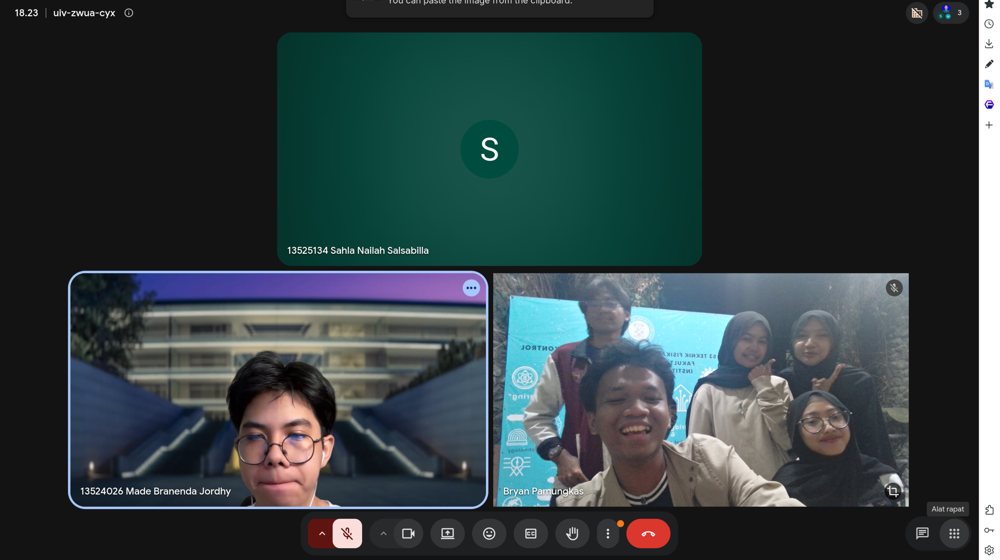
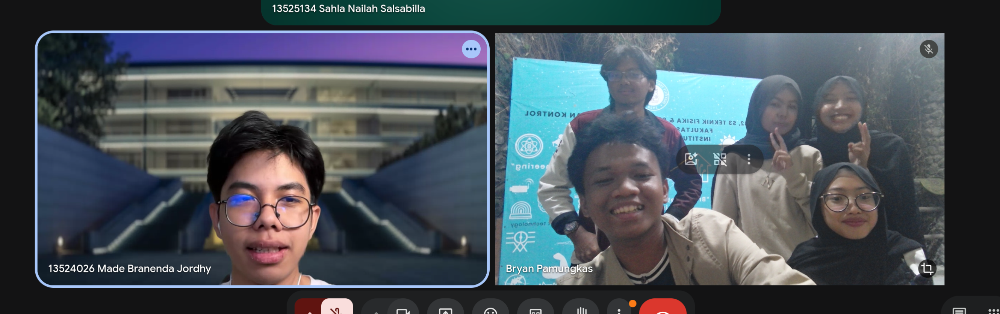

# Form Asistensi

## Tugas Besar IF2150 - Rekayasa Perangkat Lunak

| Informasi | Keterangan |
| --- | --- |
| **Hari** | Selasa |
| **Tanggal** | 1 September 2026 |
| **Kelas** | 02|
| **Nomor Kelompok** | 08  |
| **Nama Kelompok** | BS3N  |
| **Nama Perangkat Lunak** | KlimPooL  |
| **Dokumen** | K02_G08_Template1_TB.md |

### Anggota Kelompok

| NIM | Nama |
| --- | --- |
| 13525023 | Shaquille Nathan Kalevi |
| 13525080 | Neysa Alya Mukhbita |
| 13525092 | Bryan Pamungkas Prahara |
| 13525134 | Sahla Nailah Salsabilla |
| 13525140 | Nayla Putri Ghaisani |

### Catatan

| Catatan |
| --- |
| 1. Bab 3.1 direvisi dengan menggabungkan pihak-pihak yang termasuk dalam aktor Pengguna: Donatur, Volunteer, Penggalang Donasi, dan Pemilik/Pembuat Project. Pihak eksternal dihapus karena tidak berinteraksi secara langsung dengan sistem. |
| 2. Bab 3.2 direvisi dan disesuaikan dengan Bab 3.1, setiap kebutuhan dipisahkan berdasarkan role yang dimiliki oleh Pengguna agar kebutuhan sistem dapat dirincikan lebih jelas. |
| 3. Bab 3.3 ditambahkan dan disesuaikan dengan Bab 3.2 serta Bab 3.4 (diagram). |
| 4. Bab 3.4 direvisi dengan memisahkan diagram menjadi 2 bagian, lalu lebih dirincikan alur/proses dalam diagramnya. |
| 5. Menambahkan referensi artikel. |

## Dokumentasi

  

  Gambar 1. Dokumentasi kegiatan asistensi pertama.

  

  Gambar 2. Dokumentasi kegiatan asistensi pertama.

