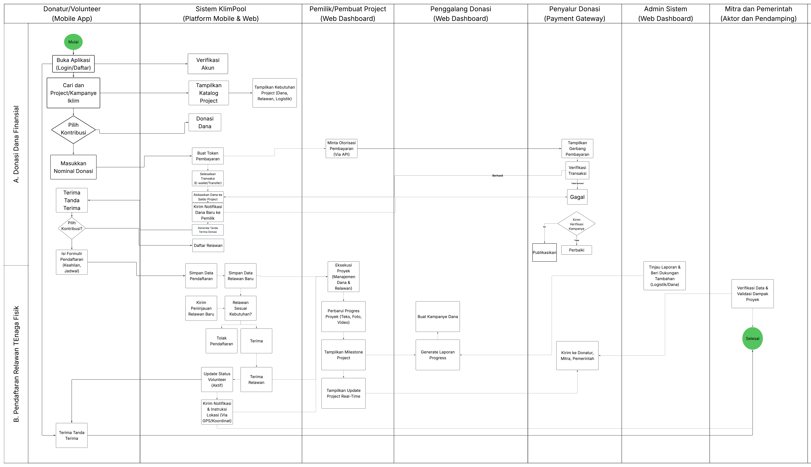

<h1>
IF2150 REKAYASA PERANGKAT LUNAK
 
TUGAS 1
 
TOPIC BRAINSTORMING
</h1>
 

## *KlimPooL*

### Untuk: Made Branenda Jordhy

Dipersiapkan oleh:
| Informasi | Keterangan |
| --- | --- |
| Kelas | 02 |
| Kelompok | 08  |

| NIM | Nama |
|---|---|
| 13525023 | Shaquille Nathan Kalevi |
| 13525080 | Neysa Alya Mukhbita |
| 13525092 | Bryan Pamungkas Prahara |
| 13525134 | Sahla Nailah Salsabilla |
| 13525140 | Nayla Putri Ghaisani |
---

 
 

# BAB 1: Analisis Permasalahan

## 1.1 Latar Belakang Masalah
Krisis iklim global kini tidak lagi sekadar ancaman masa depan, tetapi kenyataan yang sekarang kita hadapi di berbagai belahan bumi. Laporan *Intergovernmental Panel on Climate Change* menegaskan perubahan iklim yang terus memburuk telah memicu pemanasan global yang merusak keseimbangan alam secara menyeluruh. Salah satunya seperti kasus di Nepal dari fenomena pencairan gletser di wilayah Himalaya, di mana banjir luapan danau glasial menewaskan banyak korban jiwa serta menyapu infrastruktur warga. Realitas ini menegaskan keharusan pemenuhan *Sustainable Development Goals* poin ke-13 tentang Penanganan Perubahan Iklim, yang menuntut penguatan kapasitas adaptasi dan mitigasi bencana iklim secara global dan terstruktur.

Di tingkat nasional, kondisi geografis dan perubahan iklim membuat Indonesia sangat rawan terkena bencana alam. Catatan Badan Nasional Penanggulangan Bencana menunjukkan terdapat 4.940 kejadian bencana alam sepanjang tahun 2023, yang mencakup 1.802 kasus kebakaran hutan dan lahan, serta 31 gempa bumi. Tren kerentanan ini berlanjut dengan tercatatnya 2.107 kejadian bencana pada tahun 2024. Rangkaian kejadian tersebut telah menewaskan ratusan orang, memaksa lebih dari sembilan juta warga mengungsi, dan menghancurkan puluhan ribu rumah serta fasilitas umum. Kerugian masif ini membuat korban sangat bergantung pada kecepatan penyaluran dana bantuan. Urgensi permasalahan ini harus segera diselesaikan karena pengumpulan donasi sosial saat ini belum optimal, kurang terpusat, dan hanya terbatas pada keuangan saja, padahal korban juga sangat membutuhkan bantuan tenaga fisik dan pasokan logistik.

## 1.2 Analisis Kondisi Saat Ini
Dalam penanganan bencana akibat krisis iklim, proses pemulihan masyarakat terdampak tidak dapat diselesaikan hanya dengan bantuan finansial. Realita di lapangan sangat membutuhkan kehadiran relawan secara langsung untuk evakuasi darurat, distribusi logistik, hingga rekonstruksi infrastruktur. Di luar penanganan darurat, masyarakat luas juga mendesak untuk dibekali pengetahuan tentang mitigasi iklim agar kerentanan terhadap bencana di masa depan dapat ditekan.Ketersediaan dana yang cepat, pengerahan relawan yang terkoordinasi, dan edukasi lingkungan yang berkelanjutan merupakan kebutuhan mutlak yang harus dijalankan beriringan.

Saat ini, aplikasi donasi digital di Indonesia mayoritas hanya berfokus pada transaksi finansial yang muncul setelah krisis terjadi. Sistem yang ada belum menyediakan fitur untuk mengakomodasi kebutuhan operasional utama di lapangan, seperti penyaluran bantuan logistik dan pengerahan relawan. Selain itu, platform belum mengintegrasikan edukasi mitigasi iklim, sehingga partisipasi publik hanya berhenti pada pemberian donasi darurat tanpa membangun kesadaran pencegahan bencana lingkungan secara berkelanjutan.

---

# BAB 2: Analisis Solusi

## 2.1 Deskripsi Perangkat Lunak

KlimPooL adalah aplikasi berbasis web yang menghubungkan masyarakat dengan aksi iklim dan penanganan bencana di berbagai wilayah Indonesia. Dari sudut pandang pengguna, KlimPooL menyajikan peta interaktif yang menampilkan proyek lingkungan yang sedang berjalan di tiap daerah. Melalui peta tersebut, pengguna dapat menelusuri proyek di wilayah tertentu, membaca kebutuhan yang belum terpenuhi, lalu memilih bentuk kontribusi yang sesuai dengan kapasitasnya, baik berupa penyaluran dana maupun pendaftaran diri sebagai relawan. Selain berperan sebagai kontributor, setiap pengguna juga diberi keleluasaan untuk menginisiasi penggalangan dana maupun rekrutmen relawan bagi proyeknya sendiri. Seluruh inisiatif yang masuk tetap melewati verifikasi admin sebelum dipublikasikan, sehingga keterbukaan platform tidak mengorbankan kredibilitas informasi yang ditampilkan.

Perangkat lunak ini dikembangkan sebagai aplikasi berbasis web atas tiga pertimbangan. Pertama, tujuan platform adalah menjangkau partisipasi publik seluas mungkin, sehingga aksesibilitas menjadi faktor penentu; aplikasi web dapat diakses melalui peramban pada berbagai perangkat tanpa proses pemasangan. Kedua, fitur utama berupa peta interaktif berskala nasional menuntut penyajian data geografis secara dinamis, dan kebutuhan tersebut dapat dipenuhi secara optimal oleh teknologi web. Ketiga, data pada KlimPooL seperti progres donasi dan sisa kuota relawan berubah terus-menerus, sehingga pembaruan cukup dilakukan pada sisi peladen tanpa memerlukan pemutakhiran versi di sisi pengguna. Setiap pengguna dapat membuat dua jenis saldo yang terpisah, yaitu saldo pribadi yang digunakan untuk berdonasi dan saldo penggalangan dana yang menampung donasi masuk pada proyek yang ia buka.

Nilai unik KlimPooL terletak pada perluasan bentuk kontribusi yang belum terakomodasi platform sejenis. Aplikasi donasi digital di Indonesia umumnya hanya memfasilitasi bantuan berupa dana, padahal pemulihan pascabencana dan pelaksanaan proyek lingkungan sangat bergantung pada ketersediaan tenaga di lapangan. Perbandingan berikut merangkum posisi KlimPooL terhadap platform donasi yang telah ada:

| Aspek | Platform Donasi pada Umumnya | KlimPooL |
| :--- | :--- | :--- |
| Bentuk kontribusi | Terbatas pada donasi dana | Donasi dana dan penggalangan relawan yang disejajarkan |
| Penyajian proyek | Daftar campaign berbasis pencarian | Peta interaktif berbasis wilayah yang memperlihatkan sebaran persoalan iklim |
| Inisiator | Umumnya terbatas pada lembaga terverifikasi | Terbuka bagi semua pihak, dengan verifikasi admin sebelum publikasi |

Pendekatan berbasis wilayah tersebut tidak hanya berfungsi sebagai antarmuka pencarian, tetapi juga memperlihatkan sebaran persoalan iklim di Indonesia secara visual, sehingga pengguna terdorong berpartisipasi pada isu yang paling dekat dengan mereka.

## 2.2 Asumsi dan Batasan

Pengembangan KlimPooL dilandasi sejumlah asumsi, baik dari sisi teknis maupun dari sisi pengguna. Asumsi teknis berkaitan dengan kondisi sistem dan ketersediaan data yang menjadi dasar perancangan, sedangkan asumsi pengguna berkaitan dengan kemampuan dan perilaku pihak yang akan menggunakan perangkat lunak ini.

| Kategori | Asumsi |
| :--- | :--- |
| Teknis | Sistem dijalankan pada peladen yang tersedia berkelanjutan dan mampu melayani permintaan pengguna secara bersamaan |
| Teknis | Data proyek menggunakan data tiruan yang disusun tim, bukan integrasi langsung dengan basis data lembaga eksternal |
| Teknis | Setiap pengguna memiliki saldo di dalam aplikasi yang bertambah melalui proses pengisian saldo. Proses pengisian saldo tersebut merupakan data tiruan dan tidak berasal dari transaksi keuangan yang sebenarnya |
| Pengguna | Pengguna memiliki perangkat dengan peramban modern dan koneksi internet yang memadai |
| Pengguna | Pengguna memiliki literasi digital dasar untuk mendaftar akun, menelusuri proyek, dan mengisi formulir |
| Pengguna | Inisiator penggalangan bersedia menyediakan informasi yang benar dan melaporkan perkembangan proyek secara berkala |

Selain asumsi di atas, terdapat sejumlah batasan yang membingkai pengembangan KlimPooL. Batasan tersebut berasal dari ketentuan hukum yang mengatur penggalangan dana masyarakat, keterbatasan sumber daya tim, serta ruang lingkup solusi yang ditetapkan sejak awal agar pengembangan tetap terarah.

| Kategori | Batasan |
| :--- | :--- |
| Regulasi | Penggalangan dana tunduk pada ketentuan hukum yang berlaku, sehingga seluruh proyek wajib melewati verifikasi dan tidak tersedia penyaluran dana anonim |
| Sumber Daya | Dikembangkan oleh tim beranggotakan lima orang dalam rentang satu semester, bersamaan dengan tanggung jawab akademik lain |
| Sumber Daya | Prioritas pengembangan diletakkan pada fungsi inti: peta proyek, penggalangan dana, dan pengelolaan relawan |
| Ruang Lingkup | Sistem tidak melakukan pemrosesan pengisian saldo. Pengisian saldo hanya disimulasikan di dalam aplikasi, sehingga tidak ada perpindahan dana yang nyata |
| Ruang Lingkup | Cakupan wilayah terbatas pada teritori Indonesia |
| Ruang Lingkup | Sistem tidak menangani operasional proyek di lapangan, seperti pengelolaan logistik fisik dan penjadwalan kegiatan terperinci |
| Ruang Lingkup | Materi edukasi mitigasi iklim tidak termasuk cakupan utama tahap ini dan dipertimbangkan sebagai pengembangan lanjutan |

---

# BAB 3: Spesifikasi Kebutuhan dan Proses Bisnis

## 3.1 Identifikasi Aktor
Daftar seluruh aktor (pengguna) yang akan berinteraksi langsung dengan sistem beserta penjelasan singkat mengenai peran dan karakteristik masing-masing aktor:

| Aktor | Deskripsi |
| :--- | :--- |
| *Pengguna* | *Pengguna dapat bertindak sebagai donatur proyek, relawan proyek, membuka penggalangan donasi proyek, atau menciptakan dan mengelola proyek. Karakteristik dari pengguna adalah kemudahan dalam berdonasi baik sebagai donatur ataupun relawan, transparansi penggunaan dana dan pelaksanaan proyek, kemudahan dalam membuat campaign dan mengelola informasi* |
| *Admin Sistem* | *Pengguna ini bertindak sebagai pihak yang mengelola dan mengawasi keberjalanan sistem, termasuk memverifikasi pengguna dan project yang terdaftar. Karakteristik dari pengguna ini adalah mengutamakan keamanan, validitas data, dan keteraturan sistem.* |

## 3.2 Kebutuhan Pengguna Awal

| ID | Aktor | Kebutuhan / Aktivitas | Tujuan / Nilai |
| :--- | :--- | :--- | :--- |
| US-01 | *Donatur* | *Melihat daftar dan informasi climate action project* | *Menemukan project yang ingin didukung dan mengetahui kebutuhan project* |
| US-02 | *Donatur* | *Memberikan donasi berupa dana* | *Membantu memenuhi kebutuhan project dan masyarakat terdampak* |
| US-03 | *Donatur* | *Melihat perkembangan penggunaan donasi* | *Memastikan bantuan tersalurkan secara transparan dan tepat sasaran* |
| US-04 | *Penggalang Donasi* | *Membuat dan mengelola campaign penggalangan dana* | *Mengumpulkan bantuan untuk mendukung climate action project* |
| US-05 | *Penggalang Donasi* | *Menentukan target dan kebutuhan campaign* | *Memberikan informasi kebutuhan yang jelas kepada calon donatur* |
| US-06 | *Penggalang Donasi* | *Memantau dan melaporkan perkembangan campaign* | *Mengetahui pencapaian target dan meningkatkan transparansi kepada donatur* |
| US-07 | *Pemilik/Pembuat Project* | *Membuat dan mengelola climate action project* | *Mengorganisasi kegiatan penanganan atau mitigasi perubahan iklim secara terstruktur* |
| US-08 | *Pemilik/Pembuat Project* | *Menentukan kebutuhan dana, logistik, dan volunteer* | *Memastikan seluruh kebutuhan project dapat dipenuhi* |
| US-09 | *Pemilik/Pembuat Project* | *Memperbarui perkembangan project secara berkala* | *Memberikan informasi secara up-to-date kepada donatur dan volunteer* |
| US-10 | *Volunteer* | *Melihat project yang membutuhkan volunteer* | *Menemukan kesempatan untuk berkontribusi sesuai minat dan kemampuan* |
| US-11 | *Volunteer* | *Melihat informasi jadwal, lokasi, dan tugas project* | *Mempersiapkan diri sebelum mengikuti kegiatan* |
| US-12 | *Volunteer* | *Mendaftarkan diri pada project yang dipilih* | *Berpartisipasi secara langsung dalam climate action project* |
| US-13 | *Admin Sistem* | *Memverifikasi pengguna, campaign, dan project* | *Memastikan data dan project yang tersedia terpercaya* |
| US-14 | *Admin Sistem* | *Memantau aktivitas pengguna dan project* | *Menjaga keamanan dan kelancaran sistem* |
| US-15 | *Penyalur Donasi (Pihak Ketiga)* | *Memproses transaksi donasi* | *Memastikan transaksi donasi berjalan aman dan akurat* |
| US-16 | *Mitra/Sponsor (Pihak Ketiga)* | *Melihat dan memberikan dukungan kepada project* | *Menemukan project yang sesuai untuk diberikan pendanaan atau sumber daya* |
| US-17 | *Pemerintah/Lembaga Terkait (Pihak Ketiga)* | *Memberikan atau memvalidasi data terkait kondisi dan kebutuhan lingkungan* | *Memastikan informasi project dan kebutuhan di lapangan dapat dipertanggungjawabkan* |

## 3.3 Model Proses Bisnis
Berikut adalah penjelasan singkat mengenai diagram alur kerja (Activity Diagram) untuk sistem KlimPool:
1. Pendaftaran & Pengguna: Diagram dimulai dengan pendaftaran Donatur/Relawan melalui Aplikasi Mobile, yang datanya kemudian diverifikasi oleh Sistem KlimPool.
2. Alur Kontribusi (Donasi & Relawan): Dari katalog proyek, pengguna memiliki dua opsi kontribusi utama. Untuk donasi, terdapat alur terintegrasi dengan Gerbang Pembayaran (Payment Gateway) pihak ketiga untuk memproses dan mengonfirmasi transaksi. Untuk pendaftaran relawan, sistem menangani proses aplikasi hingga manajemen jadwal.
3. Pelaksanaan & Pelaporan Proyek: Pemilik Proyek dapat mencatat kemajuan dengan mengunggah foto/video kegiatan. Data ini kemudian secara otomatis dikompilasi menjadi Laporan Kemajuan Proyek melalui dasbor web mereka.
4. Tinjauan & Validasi: Tahap akhir diagram menunjukkan interaksi dengan Admin Sistem, Mitra, dan Pemerintah untuk meninjau laporan, memberikan dukungan tambahan (logistik/dana), serta melakukan validasi data dan dampak proyek.
 

<i>Gambar 1. Contoh Activity Diagram</i>

 

# Referensi
- Diagram UML: https://www.drawio.com/, https://staruml.io/
