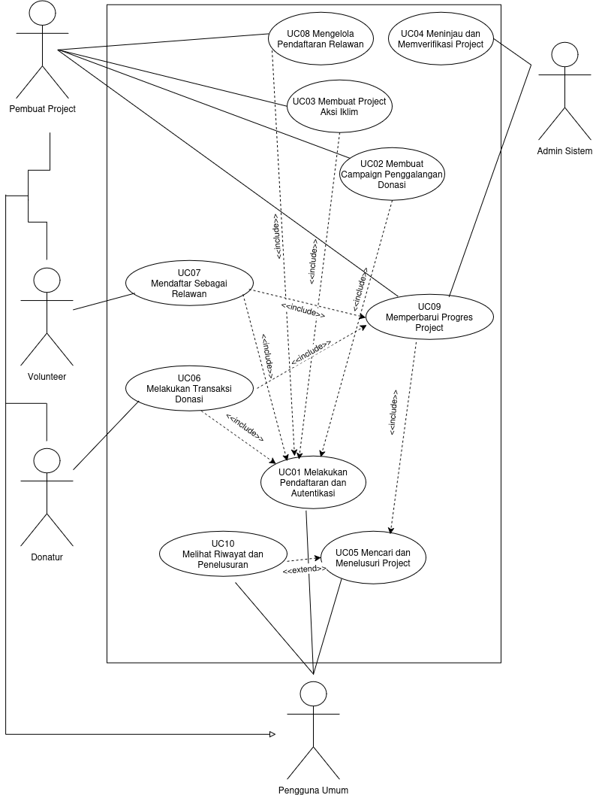

<h1>
IF2150 REKAYASA PERANGKAT LUNAK
 
TUGAS 3
 
USE CASE & SCENARIO USE CASE
</h1>
 

## KlimPooL

### Untuk: Made Branenda Jordhy

Dipersiapkan oleh:
| Informasi | Keterangan |
| --- | --- |
| Kelas | 02 |
| Kelompok | 08  |

| NIM | Nama |
|---|---|
| 13525023 | Shaquille Nathan Kalevi |
| 13525080 | Neysa Alya Mukhbita |
| 13525092 | Bryan Pamungkas Prahara |
| 13525134 | Sahla Nailah Salsabilla |
| 13525140 | Nayla Putri Ghaisani |

---

## Daftar Perubahan

| Revisi | Deskripsi |
| :--- | :--- |
| *A* | *Deskripsikan perubahan yang dilakukan dari dokumen sebelumnya pada dokumen ini. Jika tidak terdapat perubahan, harap kosongkan tabel.* |
| *B* |  |
| *C* |  |
| ... |  |

 
 

# BAB 1: Deskripsi Perangkat Lunak
Sistem KlimPooL merupakan kesatuan antara perangkat lunak berbasis web, para penggunanya, serta rangkaian kegiatan aksi iklim yang berlangsung di dunia nyata. Perangkat lunak berperan sebagai penghubung yang mempertemukan pihak yang memiliki kebutuhan penanganan iklim dengan pihak yang memiliki kapasitas untuk membantu, baik dalam bentuk dana maupun tenaga. Kegiatan inti dari sistem ini, seperti penanaman kembali lahan kritis, distribusi logistik ke wilayah terdampak bencana, maupun kegiatan pemulihan lingkungan lainnya, tetap berlangsung di lapangan. Perangkat lunak hadir untuk mengoordinasikan kebutuhan, kontribusi, dan pelaporan dari kegiatan tersebut agar dapat ditelusuri secara terbuka oleh seluruh pihak yang terlibat.

Terdapat lima pihak yang berinteraksi dengan sistem, masing-masing dengan ekspektasi yang berbeda. Donatur mengharapkan kemudahan dalam menemukan kegiatan yang sesuai dengan kepeduliannya serta kepastian bahwa dana yang ia salurkan benar-benar dimanfaatkan sebagaimana dijanjikan. Volunteer mengharapkan informasi yang memadai mengenai jadwal, lokasi, tugas, dan keahlian yang dibutuhkan, sehingga ia dapat menilai kesesuaian sebelum mendaftarkan diri. Penggalang Donasi mengharapkan sarana untuk mengumpulkan dana secara terstruktur beserta target dan periode yang jelas. Pemilik Project mengharapkan sarana untuk menyatakan kebutuhan kegiatannya secara menyeluruh, mencakup dana, logistik, dan jumlah relawan, serta mengelola pendaftar yang masuk. Admin Sistem mengharapkan kendali yang memadai untuk menjaga agar hanya kegiatan yang layak dan terpercaya yang tayang di dalam sistem.

Alur kerja sistem dimulai ketika Penggalang Donasi atau Pemilik Project mendaftarkan kegiatannya beserta seluruh kebutuhan yang menyertainya. Pengajuan tersebut tidak langsung tayang, melainkan menunggu peninjauan Admin Sistem yang memeriksa kelayakan dan kejelasan informasi. Setelah disetujui, kegiatan muncul pada peta interaktif dan katalog sehingga dapat ditelusuri oleh publik berdasarkan wilayah maupun atribut lainnya. Dari titik tersebut, pengguna dapat memilih bentuk kontribusinya. Donatur menyalurkan dana melalui saldo yang tersedia di dalam aplikasi, di mana pengisian saldo diproses melalui gerbang pembayaran yang disimulasikan tanpa melibatkan perpindahan dana yang sebenarnya. Volunteer mengisi formulir pendaftaran yang selanjutnya ditinjau oleh Pemilik Project untuk disesuaikan dengan kebutuhan dan kapasitas kegiatan.

Setelah kontribusi terkumpul, kegiatan dilaksanakan di lapangan sesuai jadwal dan lokasi yang telah ditetapkan. Pada tahap inilah proses bisnis di dunia nyata berjalan, sementara perangkat lunak berperan mencatat perkembangannya. Pemilik Project memperbarui capaian, dokumentasi, dan laporan penggunaan dana secara berkala melalui sistem. Pembaruan tersebut kemudian dapat diakses oleh Donatur dan Volunteer yang mendukung kegiatan, sehingga rangkaian proses tertutup secara utuh dari pengajuan kebutuhan hingga pertanggungjawaban hasil.

Melalui penerapan sistem ini, diharapkan partisipasi masyarakat dalam aksi iklim tidak lagi terbatas pada pemberian dana, tetapi juga mencakup keterlibatan langsung sebagai relawan. Penyajian kegiatan berdasarkan wilayah diharapkan menumbuhkan kesadaran mengenai persoalan iklim yang terjadi di sekitar pengguna sekaligus mendorong keterlibatan pada isu yang paling dekat dengan mereka. Adanya pelaporan yang dapat ditelusuri juga diharapkan menumbuhkan kepercayaan publik, sehingga kesediaan masyarakat untuk berkontribusi pada penanganan perubahan iklim dapat terjaga secara berkelanjutan.

---

# BAB 2: Kebutuhan Fungsional (KF)

| ID KF | ID Kebutuhan | Penjelasan |
| :--- | :--- | :--- |
| *KF01* | *R01* | *Ketika pengguna melakukan pendaftaran akun, sistem harus menyediakan fitur pengisian data dan data tersebut digunakan untuk login.* |
| *KF02* | *R03* | *Bila email yang dimasukkan sudah pernah digunakan, maka sistem harus menampilkan pesan kesalahan dan menolak pendaftaran.* |
| *KF03* | *R04* | *Sistem harus menyimpan password pengguna menggunakan algoritma password hashing seperti Argon2id atau bcrypt.* |
| *KF04* | *R05* | *Selama pengguna mengakses fitur yang membutuhkan autentikasi, sistem harus memastikan pengguna berada dalam status telah login.* |
| *KF05* | *R07* | *Sistem harus menyediakan fitur pembuatan campaign Penggalangan Donasi yang memuat judul, deskripsi, target dana, periode penggalangan, dan informasi penggunaan dana.* |
| *KF06* | *R09, R15* | *Sistem harus menyimpan data campaign atau project beserta informasi pembuatnya dan memberikan status verifikasi (draft, pending verification, published, atau rejected).* |
| *KF07* | *R10* | *Bila nilai target dana bernilai negatif/kosong atau rentang waktu periode tidak valid, maka sistem harus menolak pembuatan campaign.* |
| *KF08* | *R11* | *Sistem harus menyediakan fitur pembuatan campaign project aksi iklim yang memuat deskripsi kegiatan, lokasi, jadwal, kebutuhan dana, kebutuhan logistik, jumlah volunteer, dan keahlian yang dibutuhkan.* |
| *KF09* | *R13* | *Sistem harus menyimpan informasi project dan menghubungkannya dengan akun Pembuat Project yang membuatnya.* |
| *KF10* | *R14* | *Bila jadwal atau lokasi kosong atau nilai kebutuhan bernilai negatif, maka sistem harus menolak pembuatan project.* |
| *KF11* | *R17* | *Ketika peninjauan project selesai dilakukan, sistem harus memperbarui status verifikasi (diterima atau ditolak) beserta alasannya.* |
| *KF12* | *R18* | *Selama pengguna bukan Admin Sistem, sistem harus melarang akses ke fungsi peninjauan dan verifikasi.* |
| *KF13* | *R21* | *Sistem harus menyediakan fungsi pencarian dan penyaringan campaign atau project berdasarkan atribut seperti kategori, lokasi, status, atau periode kegiatan.* |
| *KF14* | *R19, R20, R22* | *Selama pengguna berstatus pengguna umum (Donatur dan Volunteer), sistem harus menampilkan hanya campaign dan project yang berstatus telah di publikasikan beserta informasi lengkapnya.* |
| *KF15* | *R23, R26* | *Ketika Donatur mengirimkan permintaan donasi, sistem harus memvalidasi saldo, mengurangi saldo Donatur, menambahkan dana ke saldo tujuan, serta mencatat transaksi dalam satu proses yang konsisten.* |
| *KF16* | *R27* | *Bila terjadi kegagalan pada salah satu tahap transaksi donasi, maka sistem harus membatalkan seluruh perubahan saldo dan pencatatan transaksi (atomic rollback & consistency).* |
| *KF17* | *R28* | *Ketika transaksi berhasil diproses, sistem harus membuat ID transaksi unik dan menyimpan riwayat transaksi yang mencakup Donatur, tujuan dana, nominal, waktu, dan status transaksi.* |
| *KF18* | *R29* | *Bila permintaan donasi menggunakan idempotency key yang sudah terdaftar, maka sistem harus menolak pemrosesan transaksi berulang.* |
| *KF19* | *R30, R32* | *Bila pengguna mengirimkan pendaftaran lebih dari satu kali pada project yang sama atau data formulir tidak lengkap (data diri, keahlian, pengalaman, dan ketersediaan jadwal), maka sistem harus menolak pengiriman pendaftaran.* |
| *KF20* | *R33, R34* | *Ketika pengguna mengirimkan pendaftaran volunteer, sistem harus menyimpan data pendaftaran dan status pendaftaran (pending, accepted, atau rejected).* |
| *KF21* | *R35, R37* | *Ketika Pembuat Project menyimpan keputusan pendaftaran, sistem harus memperbarui status pendaftaran volunteer secara otomatis.* |
| *KF22* | *R38* | *Ketika status pendaftaran diperbarui, sistem harus menampilkan informasi status penerimaan atau penolakan kepada pengguna, dan jika diterima, menampilkan instruksi lokasi serta jadwal kegiatan.* |
| *KF23* | *R39, R41* | *Ketika pembaruan progres disimpan, sistem harus mencatat data pembaruan beserta waktu pembaruan agar perkembangan project dapat ditelusuri.* |
| *KF24* | *R42* | *Sistem harus menyediakan API untuk mengunggah dan mengambil dokumentasi progres serta menghubungkannya dengan project terkait.* |
| *KF25* | *R43* | *Bila pengguna yang mencoba mengubah progres project bukan Pembuat Project terkait atau Admin Sistem, maka sistem harus menolak hak perubahan tersebut.* |
| *KF26* | *R47* | *Ketika transaksi baru berhasil diproses, sistem harus menghitung dan memperbarui total dana terkumpul serta persentase pencapaian target secara otomatis.* |
| *KF27* | *R44, R45, R48* | *Sistem harus menyediakan riwayat transaksi dan perubahan progres yang dapat ditelusuri berdasarkan waktu dan aktivitas yang dilakukan.* |

---

# BAB 3: Model Use Case

## 3.1 Identifikasi Aktor

| Aktor | Deskripsi |
| :--- | :--- |
| *Pengguna* | *Pengguna dapat bertindak sebagai donatur proyek, relawan proyek, pembuka penggalangan donasi proyek, atau pembuat dan pengelola proyek. Karakteristik dari pengguna adalah kemudahan dalam berdonasi baik sebagai donatur ataupun relawan, transparansi penggunaan dana dan pelaksanaan proyek, serta kemudahan dalam membuat campaign dan mengelola informasi.* |
| *Admin Sistem* | *Pengguna ini bertindak sebagai pihak yang mengelola dan mengawasi keberjalanan sistem, termasuk memverifikasi pengguna dan project yang terdaftar. Karakteristik dari pengguna ini adalah mengutamakan keamanan, validitas data, dan keteraturan sistem.* |

## 3.2 Identifikasi Use Case
| ID UC | Nama Use Case | Deskripsi Singkat | Aktor Terlibat | ID KF Terkait |
| :--- | :--- | :--- | :--- | :--- |
| UC01 | Melakukan Pendaftaran dan Autentikasi | Pengguna mendaftarkan akun baru dengan validasi ketersediaan email, dan sistem mengelola keamanan password serta status login. | Pengguna Umum (Pembuat Project, Donatur, Volunteer) | KF01, KF02, KF03, KF04 |
| UC02 | Membuat Campaign Penggalangan Donasi | Pembuat Project merancang campaign penggalangan dana dengan menetapkan target nominal dan periode waktu yang valid. | Pembuat Project | KF05, KF06, KF07 |
| UC03 | Membuat Project Aksi Iklim | Pembuat Project mendaftarkan project aksi iklim beserta informasi kebutuhan dana, logistik, dan kriteria relawan. | Pembuat Project | KF08, KF09, KF10 |
| UC04 | Meninjau dan Memverifikasi Project | Admin meninjau pengajuan campaign atau project yang masuk dan memperbarui status verifikasinya (diterima/ditolak). | Admin Sistem | KF11, KF12 |
| UC05 | Mencari dan Menelusuri Project | Pengguna mencari, menyaring, dan melihat detail informasi campaign atau project yang berstatus telah dipublikasikan. | Pengguna Umum (Pembuat Project, Donatur, Volunteer) | KF13, KF14 |
| UC06 | Melakukan Transaksi Donasi | Donatur mengirimkan dana donasi yang diproses secara konsisten (atomic), mencegah duplikasi, dan otomatis memperbarui total dana campaign. | Donatur | KF15, KF16, KF17, KF18, KF26 |
| UC07 | Mendaftar Sebagai Relawan | Pengguna mendaftar menjadi volunteer pada project aksi iklim dengan melengkapi data diri dan keahlian secara lengkap. | Volunteer | KF19, KF20 |
| UC08 | Mengelola Pendaftaran Relawan | Pembuat Project meninjau pendaftaran volunteer, memberikan keputusan (terima/tolak), dan sistem menampilkan instruksi kegiatan. | Pembuat Project | KF21, KF22 |
| UC09 | Memperbarui Progres Project | Pembuat Project atau Admin mengunggah pembaruan kegiatan dan dokumentasi progres yang terhubung langsung dengan project. | Pembuat Project, Admin Sistem | KF23, KF24, KF25 |
| UC10 | Melihat Riwayat dan Penelusuran | Pengguna mengakses riwayat lengkap terkait transaksi donasi dan melacak perubahan progres project berdasarkan urutan waktu. | Pengguna Umum (Pembuat Project, Donatur, Volunteer) | KF27 |

## 3.3 Use Case Diagram
 

<i>Gambar 1. Use Case Diagram</i>

 

## 3.4 Skenario Use Case

### 3.4.1 Skenario UC01

**Nama Use Case: Melakukan Pendaftaran dan Autentikasi**

#### Skenario Normal

| No | Aksi Aktor | Reaksi Perangkat Lunak |
| :--- | :--- | :--- |
| 1 | Pengguna memilih menu pendaftaran | Sistem menampilkan formulir pendaftaran yang berisi data yang diperlukan, seperti nama, email, dan password |
| 2 | Pengguna mengisi data pendaftaran dan mengirimkan formulir | Sistem memvalidasi kelengkapan dan format data yang diberikan |
| 3 | Pengguna menggunakan email yang belum terdaftar | Sistem menyimpan akun baru dan mengamankan password pengguna |
| 4 | Pengguna memasukkan email dan password pada halaman login | Sistem memvalidasi kredensial pengguna |
| 5 | Pengguna berhasil melakukan login | Sistem membuat sesi login dan mengarahkan pengguna ke halaman utama |

#### Skenario Alternatif 1: Email Sudah Terdaftar

| No | Aksi Aktor | Reaksi Perangkat Lunak |
| :--- | :--- | :--- |
| 1 | Pengguna mengisi formulir pendaftaran menggunakan email yang sudah terdaftar | Sistem mendeteksi bahwa email telah digunakan |
| 2 | Pengguna memperbaiki email atau memilih untuk login | Sistem kembali menampilkan formulir pendaftaran atau mengarahkan pengguna ke halaman login |

#### Skenario Alternatif 2: Kredensial Login Tidak Valid

| No | Aksi Aktor | Reaksi Perangkat Lunak |
| :--- | :--- | :--- |
| 1 | Pengguna memasukkan email atau password yang salah | Sistem menolak proses login dan menampilkan pesan bahwa email atau password tidak valid |
| 2 | Pengguna memasukkan kembali email dan password | Sistem kembali melakukan validasi kredensial |

---

### 3.4.2 Skenario UC02

**Nama Use Case: Membuat Campaign Penggalangan Donasi**

#### Skenario Normal

| No | Aksi Aktor | Reaksi Perangkat Lunak |
| :--- | :--- | :--- |
| 1 | Pengguna memilih menu untuk membuat campaign penggalangan donasi | Sistem menampilkan formulir pembuatan campaign |
| 2 | Pengguna mengisi informasi campaign, seperti judul, deskripsi, target nominal, dan periode campaign | Sistem memvalidasi kelengkapan dan format data yang dimasukkan |
| 3 | Pengguna mengirimkan formulir campaign | Sistem memeriksa validitas target nominal dan periode campaign |
| 4 | Data campaign dinyatakan valid | Sistem menyimpan campaign dengan status menunggu verifikasi |
| 5 | Pengguna melihat halaman campaign yang telah dibuat | Sistem menampilkan informasi campaign beserta status verifikasinya |

#### Skenario Alternatif 1: Data Campaign Tidak Lengkap

| No | Aksi Aktor | Reaksi Perangkat Lunak |
| :--- | :--- | :--- |
| 1 | Pengguna mengirimkan formulir dengan data yang belum lengkap | Sistem menampilkan pesan kesalahan pada bagian yang belum diisi |
| 2 | Pengguna melengkapi data yang diperlukan | Sistem kembali melakukan validasi terhadap data campaign |

#### Skenario Alternatif 2: Target atau Periode Campaign Tidak Valid

| No | Aksi Aktor | Reaksi Perangkat Lunak |
| :--- | :--- | :--- |
| 1 | Pengguna memasukkan target nominal atau periode campaign yang tidak valid | Sistem menampilkan pesan kesalahan dan menjelaskan data yang perlu diperbaiki |
| 2 | Pengguna memperbaiki target nominal atau periode campaign | Sistem kembali melakukan validasi terhadap data yang diperbaiki |

---

### 3.4.3 Skenario UC03

**Nama Use Case: Membuat Project Aksi Iklim**

#### Skenario Normal

| No | Aksi Aktor | Reaksi Perangkat Lunak |
| :--- | :--- | :--- |
| 1 | Pengguna memilih menu untuk membuat project aksi iklim | Sistem menampilkan formulir pembuatan project |
| 2 | Pengguna mengisi informasi project, seperti nama, deskripsi, lokasi, dan tujuan project | Sistem menampilkan data yang telah dimasukkan untuk diperiksa |
| 3 | Pengguna mengisi kebutuhan project berupa dana, logistik, dan kriteria volunteer | Sistem menyimpan informasi kebutuhan project |
| 4 | Pengguna mengirimkan formulir project | Sistem memvalidasi kelengkapan dan format data project |
| 5 | Data project dinyatakan valid | Sistem menyimpan project dengan status menunggu verifikasi |
| 6 | Pengguna membuka halaman project yang dibuat | Sistem menampilkan informasi project beserta status verifikasinya |

#### Skenario Alternatif 1: Informasi Project Tidak Lengkap

| No | Aksi Aktor | Reaksi Perangkat Lunak |
| :--- | :--- | :--- |
| 1 | Pengguna mengirimkan formulir dengan informasi project yang belum lengkap | Sistem menampilkan pesan kesalahan dan menunjukkan data yang perlu dilengkapi |
| 2 | Pengguna melengkapi informasi project | Sistem kembali melakukan validasi terhadap data project |

#### Skenario Alternatif 2: Data Kebutuhan Project Tidak Valid

| No | Aksi Aktor | Reaksi Perangkat Lunak |
| :--- | :--- | :--- |
| 1 | Pengguna memasukkan data kebutuhan dana, logistik, atau kriteria volunteer yang tidak sesuai | Sistem menampilkan pesan kesalahan pada data yang tidak valid |
| 2 | Pengguna memperbaiki data kebutuhan project | Sistem kembali melakukan validasi terhadap data yang diperbaiki |

---

### 3.4.4 Skenario UC04

**Nama Use Case: Meninjau dan Memverifikasi Project**

#### Skenario Normal

| No | Aksi Aktor | Reaksi Perangkat Lunak |
| :--- | :--- | :--- |
| 1 | Admin Sistem membuka halaman daftar pengajuan campaign dan project | Sistem menampilkan daftar campaign dan project yang berstatus menunggu verifikasi |
| 2 | Admin Sistem memilih salah satu campaign atau project | Sistem menampilkan detail informasi campaign atau project |
| 3 | Admin Sistem memeriksa kelengkapan dan validitas informasi | Sistem menampilkan seluruh data yang diperlukan untuk proses verifikasi |
| 4 | Admin Sistem menyetujui campaign atau project | Sistem mengubah status menjadi diterima dan mempublikasikan campaign atau project |
| 5 | Admin Sistem kembali ke daftar pengajuan | Sistem memperbarui status campaign atau project menjadi diterima |

#### Skenario Alternatif 1: Campaign atau Project Ditolak

| No | Aksi Aktor | Reaksi Perangkat Lunak |
| :--- | :--- | :--- |
| 1 | Admin Sistem memilih campaign atau project yang tidak memenuhi persyaratan | Sistem menampilkan detail campaign atau project |
| 2 | Admin Sistem memilih opsi tolak dan memberikan alasan penolakan | Sistem menyimpan alasan penolakan dan mengubah status menjadi ditolak |
| 3 | Admin Sistem kembali ke daftar pengajuan | Sistem menampilkan campaign atau project dengan status ditolak |

---

### 3.4.5 Skenario UC05

**Nama Use Case: Mencari dan Menelusuri Project**

#### Skenario Normal

| No | Aksi Aktor | Reaksi Perangkat Lunak |
| :--- | :--- | :--- |
| 1 | Pengguna membuka halaman daftar project | Sistem menampilkan daftar campaign dan project yang telah dipublikasikan |
| 2 | Pengguna memasukkan kata kunci atau memilih filter yang diinginkan | Sistem memproses kata kunci dan filter yang dipilih |
| 3 | Pengguna memilih salah satu campaign atau project dari hasil pencarian | Sistem menampilkan detail campaign atau project yang dipilih |
| 4 | Pengguna melihat informasi campaign atau project | Sistem menampilkan informasi seperti deskripsi, kebutuhan, target donasi, lokasi, dan status project |

#### Skenario Alternatif 1: Project Tidak Ditemukan

| No | Aksi Aktor | Reaksi Perangkat Lunak |
| :--- | :--- | :--- |
| 1 | Pengguna memasukkan kata kunci atau filter tertentu | Sistem melakukan pencarian berdasarkan kata kunci atau filter |
| 2 | Tidak terdapat campaign atau project yang sesuai | Sistem menampilkan pesan bahwa project yang sesuai tidak ditemukan |
| 3 | Pengguna mengubah kata kunci atau filter pencarian | Sistem menampilkan hasil pencarian berdasarkan kriteria yang baru |

### 3.4.6 Skenario UC06

*Nama Use Case: Melakukan Transaksi Donasi*

#### Skenario Normal

| No | Aksi Aktor | Reaksi Perangkat Lunak |
| :--- | :--- | :--- |
| 1 | Donatur memilih campaign / project yang ingin didukung dan menekan tombol donasi | Sistem memastikan Donatur telah login dan menampilkan formulir masukan nominal donasi beserta saldo Donatur yang tersedia |
| 2 | 	Donatur memasukkan nominal donasi dan mengonfirmasi pembayaran | Sistem memvalidasi kelayakan saldo dan mengirimkan permintaan donasi disertai idempotency key unik. Sistem menampilkan bukti transaksi berhasil kepada Donatur |

#### Skenario Alternatif 1: Saldo Tidak Mencukupi / Kegagalan Transaksi 

| No | Aksi Aktor | Reaksi Perangkat Lunak |
| :--- | :--- | :--- |
| 1 | Donatur mengonfirmasi pembayaran dengan nominal melebihi saldo atau terjadi gangguan sistem saat pemrosesan | Sistem membatalkan seluruh proses transaksi (atomic rollback), tidak mengoperasikan perubahan saldo, dan menampilkan pesan kegagalan transaksi |

#### Skenario Alternatif 2: Duplikasi Permintaan Transaksi (Idempotency Key)

| No | Aksi Aktor | Reaksi Perangkat Lunak |
| :--- | :--- | :--- |
| 1 | Donatur secara tidak sengaja menekan tombol konfirmasi pembayaran lebih dari satu kali | Sistem mendeteksi idempotency key yang sudah terdaftar, menolak pemrosesan transaksi berulang, dan menampilkan status transaksi sebelumnya |

### 3.4.7 Skenario UC07

*Nama Use Case: Mendaftar Sebagai Relawan*

#### Skenario Normal

| No | Aksi Aktor | Reaksi Perangkat Lunak |
| :--- | :--- | :--- |
| 1 | Volunteer memilih project aksi iklim dan menekan tombol daftar relawan | Sistem memastikan pengguna telah login dan menampilkan formulir pendaftaran relawan |
| 2 | Volunteer mengisi formulir (data diri, keahlian, pengalaman, dan ketersediaan jadwal) lalu mengirimkan pendaftaran | Sistem memvalidasi kelengkapan formulir pendaftaran dan menyimpan status pendaftaran untuk diteruskan ke Pembuat Project |

#### Skenario Alternatif 1: Formulir Tidak Lengkap atau Pendaftaran Ganda

| No | Aksi Aktor | Reaksi Perangkat Lunak |
| :--- | :--- | :--- |
| 1 | 	Volunteer mengosongkan salah satu bidang wajib atau mendaftar kembali pada project yang sama | Sistem mendeteksi kelengkapan data yang kurang atau status pendaftaran ganda, menolak pengiriman formulir, dan menampilkan pesan peringatan | 

### 3.4.8 Skenario UC08

*Nama Use Case: Mengelola Pendaftaran Relawan*

#### Skenario Normal

| No | Aksi Aktor | Reaksi Perangkat Lunak |
| :--- | :--- | :--- |
| 1 | Pembuat Project membuka menu kelola relawan pada project miliknya | Sistem menampilkan daftar pendaftar volunteer beserta detail data diri, keahlian, pengalaman, dan ketersediaan jadwal |
| 2 | Pembuat Project meninjau data dan memilih keputusan (Terima / Tolak) untuk pendaftar tersebut | Sistem menyimpan keputusan dan memperbarui status pendaftaran secara otomatis (accepted / rejected) dan memperbarui tampilan bagi Volunteer: menampilkan informasi penerimaan beserta instruksi lokasi dan jadwal (jika diterima) atau status penolakan |

### 3.4.9 Skenario UC09

*Nama Use Case: Memperbarui Progres Project*

#### Skenario Normal

| No | Aksi Aktor | Reaksi Perangkat Lunak |
| :--- | :--- | :--- |
| 1 | Pembuat Project atau Admin Sistem membuka halaman pembaruan progres pada project terkait | Sistem memvalidasi hak akses pengguna terhadap project tersebut dan menampilkan formulir pembaruan progres |
| 2 | Aktor mengisi data pembaruan milestone, status pelaksanaan, dan mengunggah dokumentasi | Sistem mengunggah dokumentasi, mencatat riwayat pembaruan beserta stempel waktu (timestamp), dan menghubungkannya dengan project |

#### Skenario Alternatif 1: Akses Ditolak (Bukan Pembuat Project / Admin)

| No | Aksi Aktor | Reaksi Perangkat Lunak |
| :--- | :--- | :--- |
| 1 | Pengguna yang tidak memiliki hak akses mencoba mengakses fitur perubahan progres project | Sistem menolak izin akses dan menampilkan pesan bahwa tindakan tidak diizinkan |

### 3.4.10 Skenario UC10

*Nama Use Case: Melihat Riwayat dan Penelusuran*

#### Skenario Normal

| No | Aksi Aktor | Reaksi Perangkat Lunak |
| :--- | :--- | :--- |
| 1 | Pengguna membuka menu riwayat dan penelusuran aktivitas | Sistem menampilkan daftar riwayat transaksi donasi dan pembaruan progres project yang pernah didukung/dikelola secara urut waktu (chronological order) |
| 2 | Pengguna memilih salah satu entitas riwayat transaksi atau laporan progres | Sistem menampilkan detail informasi transaksi (nominal, waktu, status) atau rincian laporan penggunaan dana dan perkembangan project |
