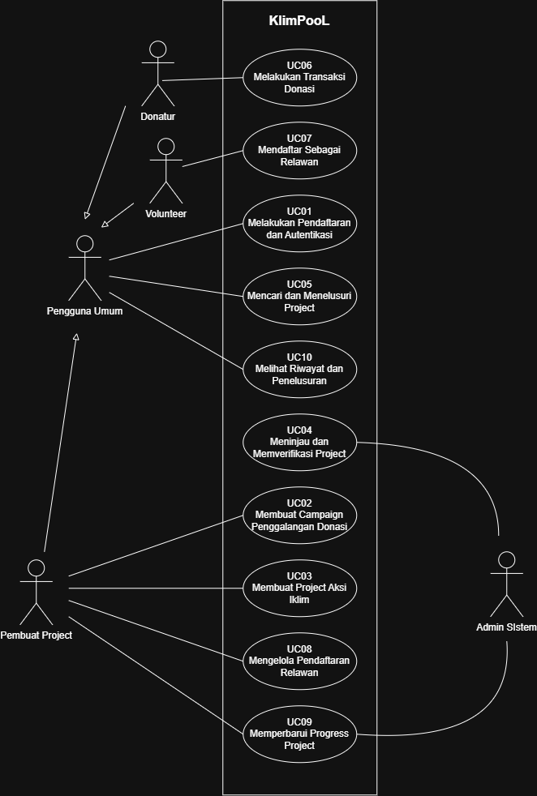

<h1>
IF2150 REKAYASA PERANGKAT LUNAK
 
TUGAS 3
 
USE CASE & SCENARIO USE CASE
</h1>
 

## KlimPooL

### Untuk: Made Branenda Jordhy

Dipersiapkan oleh:
| Informasi | Keterangan |
| --- | --- |
| Kelas | 02 |
| Kelompok | 08  |

| NIM | Nama |
|---|---|
| 13525023 | Shaquille Nathan Kalevi |
| 13525080 | Neysa Alya Mukhbita |
| 13525092 | Bryan Pamungkas Prahara |
| 13525134 | Sahla Nailah Salsabilla |
| 13525140 | Nayla Putri Ghaisani |

---

## Daftar Perubahan

| Revisi | Deskripsi |
| :--- | :--- |
| *A* | *Deskripsikan perubahan yang dilakukan dari dokumen sebelumnya pada dokumen ini. Jika tidak terdapat perubahan, harap kosongkan tabel.* |
| *B* |  |
| *C* |  |
| ... |  |

 
 

# BAB 1: Deskripsi Perangkat Lunak
Bagian ini boleh disalin dari 1.1 Deskripsi Umum Sistem pada dokumen *Requirement Gathering*. Pastikan isinya memang membahas deskripsi perangkat lunak kalian, seperti fitur, fungsi utama, dan cakupan sistem.

---

# BAB 2: Kebutuhan Fungsional (KF)
Salin ulang **seluruh Kebutuhan Fungsional (KF)** yang telah didefinisikan pada dokumen *Requirement Gathering*. Tabel ini menjadi acuan *traceability*, dimana setiap Use Case pada BAB 3 wajib ditelusuri ke satu atau lebih ID KF di tabel ini, dan sebaliknya setiap KF idealnya tercakup oleh minimal satu Use Case. Pastikan juga sudah menggunakan **format EARS** dalam penulisan KF.

| ID KF | Kebutuhan | Penjelasan |
| :--- | :--- | :--- |
| *KF01* | *Menampilkan pilihan metode pembayaran* | *Perangkat lunak dapat menampilkan pilihan antarmuka metode pembayaran (transfer bank, e-wallet, kartu kredit) setelah pengguna melakukan checkout.* |
| *KF02* | *Mengirim permintaan otorisasi pembayaran* | *Perangkat lunak dapat mengirimkan permintaan otorisasi transaksi ke API Payment Gateway beserta nominal tagihan dan ID Pesanan.* |
| *...* | *...* | *...* |

 ***Catatan***: *Jika ada KF dari ML2 yang berubah/bertambah/dihapus setelah asistensi, pastikan tabel ini konsisten dengan versi KF terbaru sebelum dikumpulkan.*

---

# BAB 3: Model Use Case

## 3.1 Identifikasi Aktor
Daftarkan seluruh aktor yang terlibat dalam use case yang akan dimodelkan. Aktor berupa pengguna manusia yang berinteraksi dengan solusi. Perlu diperhatikan bahwa Admin/Developer/ Pihak Eksternal lain yang bisa diotomisasi, tidak perlu dijadikan aktor.

| Aktor | Deskripsi |
| :--- | :--- |
| *Pelanggan* | *Pengguna yang melakukan transaksi pembelian dan pembayaran melalui sistem.* |
| *Kasir* | *Pengguna internal toko yang memverifikasi status pembayaran pelanggan sebelum menyerahkan barang.* |
| *...* | *...* |

## 3.2 Identifikasi Use Case
| ID UC | Nama Use Case | Deskripsi Singkat | Aktor Terlibat | ID KF Terkait |
| :--- | :--- | :--- | :--- | :--- |
| UC01 | Melakukan Pendaftaran dan Autentikasi | Pengguna mendaftarkan akun baru dengan validasi ketersediaan email, dan sistem mengelola keamanan password serta status login. | Pengguna Umum (Pembuat Project, Donatur, Volunteer) | KF01, KF02, KF03, KF04 |
| UC02 | Membuat Campaign Penggalangan Donasi | Pembuat Project merancang campaign penggalangan dana dengan menetapkan target nominal dan periode waktu yang valid. | Pembuat Project | KF05, KF06, KF07 |
| UC03 | Membuat Project Aksi Iklim | Pembuat Project mendaftarkan project aksi iklim beserta informasi kebutuhan dana, logistik, dan kriteria relawan. | Pembuat Project | KF08, KF09, KF10 |
| UC04 | Meninjau dan Memverifikasi Project | Admin meninjau pengajuan campaign atau project yang masuk dan memperbarui status verifikasinya (diterima/ditolak). | Admin Sistem | KF11, KF12 |
| UC05 | Mencari dan Menelusuri Project | Pengguna mencari, menyaring, dan melihat detail informasi campaign atau project yang berstatus telah dipublikasikan. | Pengguna Umum (Pembuat Project, Donatur, Volunteer) | KF13, KF14 |
| UC06 | Melakukan Transaksi Donasi | Donatur mengirimkan dana donasi yang diproses secara konsisten (atomic), mencegah duplikasi, dan otomatis memperbarui total dana campaign. | Donatur | KF15, KF16, KF17, KF18, KF26 |
| UC07 | Mendaftar Sebagai Relawan | Pengguna mendaftar menjadi volunteer pada project aksi iklim dengan melengkapi data diri dan keahlian secara lengkap. | Volunteer | KF19, KF20 |
| UC08 | Mengelola Pendaftaran Relawan | Pembuat Project meninjau pendaftaran volunteer, memberikan keputusan (terima/tolak), dan sistem menampilkan instruksi kegiatan. | Pembuat Project | KF21, KF22 |
| UC09 | Memperbarui Progres Project | Pembuat Project atau Admin mengunggah pembaruan kegiatan dan dokumentasi progres yang terhubung langsung dengan project. | Pembuat Project, Admin Sistem | KF23, KF24, KF25 |
| UC10 | Melihat Riwayat dan Penelusuran | Pengguna mengakses riwayat lengkap terkait transaksi donasi dan melacak perubahan progres project berdasarkan urutan waktu. | Pengguna Umum (Pembuat Project, Donatur, Volunteer) | KF27 |

## 3.3 Use Case Diagram
 

<i>Gambar 1. Use Case Diagram</i>

 

Seluruh use case pada diagram terhubung langsung ke aktornya melalui relasi asosiasi. Relasi include dan extend tidak digunakan karena tidak terdapat perilaku yang wajib dijalankan bersama oleh beberapa use case, maupun perilaku opsional yang cukup besar untuk dimodelkan sebagai use case perluasan. Kondisi kegagalan seperti penolakan donasi atau penolakan pendaftaran relawan dimodelkan sebagai skenario alternatif pada subbab 3.4. Relasi generalisasi digunakan pada aktor Pembuat Project, Donatur, dan Volunteer yang mewarisi asosiasi dari aktor Pengguna Umum.

## 3.4 Skenario Use Case
Buat skenario untuk **setiap** use case yang telah diidentifikasi pada 3.2. Setiap skenario dapat terdiri dari dua jenis alur:
- **Skenario Normal**: alur utama (*happy path*) di mana interaksi aktor-sistem berjalan lancar tanpa kendala hingga tujuan use case tercapai.
- **Skenario Alternatif**: alur percabangan dari skenario normal, misalnya kondisi gagal, input tidak valid, atau pilihan lain yang tersedia bagi aktor. Boleh ada lebih dari satu skenario alternatif per use case jika ada beberapa titik percabangan berbeda.

Format tabel skenario: kolom **Aksi Aktor** berisi apa yang dilakukan/diinput aktor, kolom **Reaksi Perangkat Lunak** berisi respons sistem terhadap aksi tersebut secara **berurutan** (nomor langkah harus berpasangan/selaras antar dua kolom).

### 3.4.1 Skenario UC01

**Nama Use Case: Melakukan Pendaftaran dan Autentikasi**

#### Skenario Normal

| No | Aksi Aktor | Reaksi Perangkat Lunak |
| :--- | :--- | :--- |
| 1 | Pengguna memilih menu pendaftaran | Sistem menampilkan formulir pendaftaran yang berisi data yang diperlukan, seperti nama, email, dan password |
| 2 | Pengguna mengisi data pendaftaran dan mengirimkan formulir | Sistem memvalidasi kelengkapan dan format data yang diberikan |
| 3 | Pengguna menggunakan email yang belum terdaftar | Sistem menyimpan akun baru dan mengamankan password pengguna |
| 4 | Pengguna memasukkan email dan password pada halaman login | Sistem memvalidasi kredensial pengguna |
| 5 | Pengguna berhasil melakukan login | Sistem membuat sesi login dan mengarahkan pengguna ke halaman utama |

#### Skenario Alternatif 1: Email Sudah Terdaftar

| No | Aksi Aktor | Reaksi Perangkat Lunak |
| :--- | :--- | :--- |
| 1 | Pengguna mengisi formulir pendaftaran menggunakan email yang sudah terdaftar | Sistem mendeteksi bahwa email telah digunakan |
| 2 | Pengguna memperbaiki email atau memilih untuk login | Sistem kembali menampilkan formulir pendaftaran atau mengarahkan pengguna ke halaman login |

#### Skenario Alternatif 2: Kredensial Login Tidak Valid

| No | Aksi Aktor | Reaksi Perangkat Lunak |
| :--- | :--- | :--- |
| 1 | Pengguna memasukkan email atau password yang salah | Sistem menolak proses login dan menampilkan pesan bahwa email atau password tidak valid |
| 2 | Pengguna memasukkan kembali email dan password | Sistem kembali melakukan validasi kredensial |

---

### 3.4.2 Skenario UC02

**Nama Use Case: Membuat Campaign Penggalangan Donasi**

#### Skenario Normal

| No | Aksi Aktor | Reaksi Perangkat Lunak |
| :--- | :--- | :--- |
| 1 | Pengguna memilih menu untuk membuat campaign penggalangan donasi | Sistem menampilkan formulir pembuatan campaign |
| 2 | Pengguna mengisi informasi campaign, seperti judul, deskripsi, target nominal, dan periode campaign | Sistem memvalidasi kelengkapan dan format data yang dimasukkan |
| 3 | Pengguna mengirimkan formulir campaign | Sistem memeriksa validitas target nominal dan periode campaign |
| 4 | Data campaign dinyatakan valid | Sistem menyimpan campaign dengan status menunggu verifikasi |
| 5 | Pengguna melihat halaman campaign yang telah dibuat | Sistem menampilkan informasi campaign beserta status verifikasinya |

#### Skenario Alternatif 1: Data Campaign Tidak Lengkap

| No | Aksi Aktor | Reaksi Perangkat Lunak |
| :--- | :--- | :--- |
| 1 | Pengguna mengirimkan formulir dengan data yang belum lengkap | Sistem menampilkan pesan kesalahan pada bagian yang belum diisi |
| 2 | Pengguna melengkapi data yang diperlukan | Sistem kembali melakukan validasi terhadap data campaign |

#### Skenario Alternatif 2: Target atau Periode Campaign Tidak Valid

| No | Aksi Aktor | Reaksi Perangkat Lunak |
| :--- | :--- | :--- |
| 1 | Pengguna memasukkan target nominal atau periode campaign yang tidak valid | Sistem menampilkan pesan kesalahan dan menjelaskan data yang perlu diperbaiki |
| 2 | Pengguna memperbaiki target nominal atau periode campaign | Sistem kembali melakukan validasi terhadap data yang diperbaiki |

---

### 3.4.3 Skenario UC03

**Nama Use Case: Membuat Project Aksi Iklim**

#### Skenario Normal

| No | Aksi Aktor | Reaksi Perangkat Lunak |
| :--- | :--- | :--- |
| 1 | Pengguna memilih menu untuk membuat project aksi iklim | Sistem menampilkan formulir pembuatan project |
| 2 | Pengguna mengisi informasi project, seperti nama, deskripsi, lokasi, dan tujuan project | Sistem menampilkan data yang telah dimasukkan untuk diperiksa |
| 3 | Pengguna mengisi kebutuhan project berupa dana, logistik, dan kriteria volunteer | Sistem menyimpan informasi kebutuhan project |
| 4 | Pengguna mengirimkan formulir project | Sistem memvalidasi kelengkapan dan format data project |
| 5 | Data project dinyatakan valid | Sistem menyimpan project dengan status menunggu verifikasi |
| 6 | Pengguna membuka halaman project yang dibuat | Sistem menampilkan informasi project beserta status verifikasinya |

#### Skenario Alternatif 1: Informasi Project Tidak Lengkap

| No | Aksi Aktor | Reaksi Perangkat Lunak |
| :--- | :--- | :--- |
| 1 | Pengguna mengirimkan formulir dengan informasi project yang belum lengkap | Sistem menampilkan pesan kesalahan dan menunjukkan data yang perlu dilengkapi |
| 2 | Pengguna melengkapi informasi project | Sistem kembali melakukan validasi terhadap data project |

#### Skenario Alternatif 2: Data Kebutuhan Project Tidak Valid

| No | Aksi Aktor | Reaksi Perangkat Lunak |
| :--- | :--- | :--- |
| 1 | Pengguna memasukkan data kebutuhan dana, logistik, atau kriteria volunteer yang tidak sesuai | Sistem menampilkan pesan kesalahan pada data yang tidak valid |
| 2 | Pengguna memperbaiki data kebutuhan project | Sistem kembali melakukan validasi terhadap data yang diperbaiki |

---

### 3.4.4 Skenario UC04

**Nama Use Case: Meninjau dan Memverifikasi Project**

#### Skenario Normal

| No | Aksi Aktor | Reaksi Perangkat Lunak |
| :--- | :--- | :--- |
| 1 | Admin Sistem membuka halaman daftar pengajuan campaign dan project | Sistem menampilkan daftar campaign dan project yang berstatus menunggu verifikasi |
| 2 | Admin Sistem memilih salah satu campaign atau project | Sistem menampilkan detail informasi campaign atau project |
| 3 | Admin Sistem memeriksa kelengkapan dan validitas informasi | Sistem menampilkan seluruh data yang diperlukan untuk proses verifikasi |
| 4 | Admin Sistem menyetujui campaign atau project | Sistem mengubah status menjadi diterima dan mempublikasikan campaign atau project |
| 5 | Admin Sistem kembali ke daftar pengajuan | Sistem memperbarui status campaign atau project menjadi diterima |

#### Skenario Alternatif 1: Campaign atau Project Ditolak

| No | Aksi Aktor | Reaksi Perangkat Lunak |
| :--- | :--- | :--- |
| 1 | Admin Sistem memilih campaign atau project yang tidak memenuhi persyaratan | Sistem menampilkan detail campaign atau project |
| 2 | Admin Sistem memilih opsi tolak dan memberikan alasan penolakan | Sistem menyimpan alasan penolakan dan mengubah status menjadi ditolak |
| 3 | Admin Sistem kembali ke daftar pengajuan | Sistem menampilkan campaign atau project dengan status ditolak |

---

### 3.4.5 Skenario UC05

**Nama Use Case: Mencari dan Menelusuri Project**

#### Skenario Normal

| No | Aksi Aktor | Reaksi Perangkat Lunak |
| :--- | :--- | :--- |
| 1 | Pengguna membuka halaman daftar project | Sistem menampilkan daftar campaign dan project yang telah dipublikasikan |
| 2 | Pengguna memasukkan kata kunci atau memilih filter yang diinginkan | Sistem memproses kata kunci dan filter yang dipilih |
| 3 | Pengguna memilih salah satu campaign atau project dari hasil pencarian | Sistem menampilkan detail campaign atau project yang dipilih |
| 4 | Pengguna melihat informasi campaign atau project | Sistem menampilkan informasi seperti deskripsi, kebutuhan, target donasi, lokasi, dan status project |

#### Skenario Alternatif 1: Project Tidak Ditemukan

| No | Aksi Aktor | Reaksi Perangkat Lunak |
| :--- | :--- | :--- |
| 1 | Pengguna memasukkan kata kunci atau filter tertentu | Sistem melakukan pencarian berdasarkan kata kunci atau filter |
| 2 | Tidak terdapat campaign atau project yang sesuai | Sistem menampilkan pesan bahwa project yang sesuai tidak ditemukan |
| 3 | Pengguna mengubah kata kunci atau filter pencarian | Sistem menampilkan hasil pencarian berdasarkan kriteria yang baru |