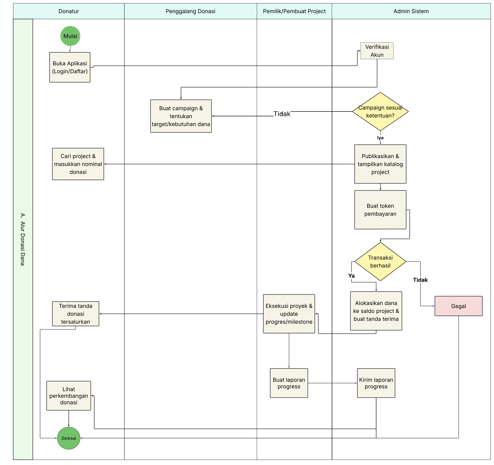
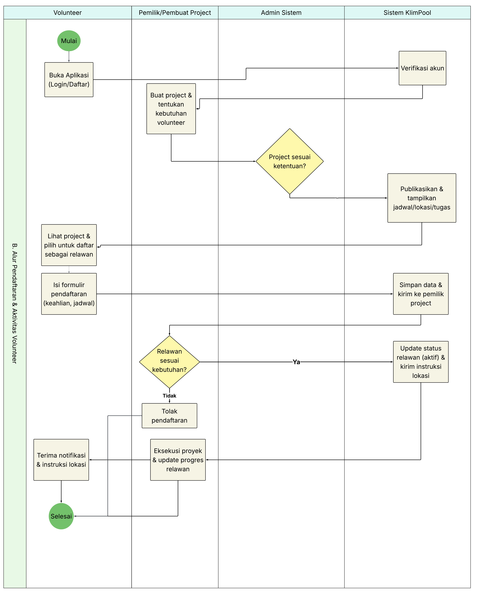
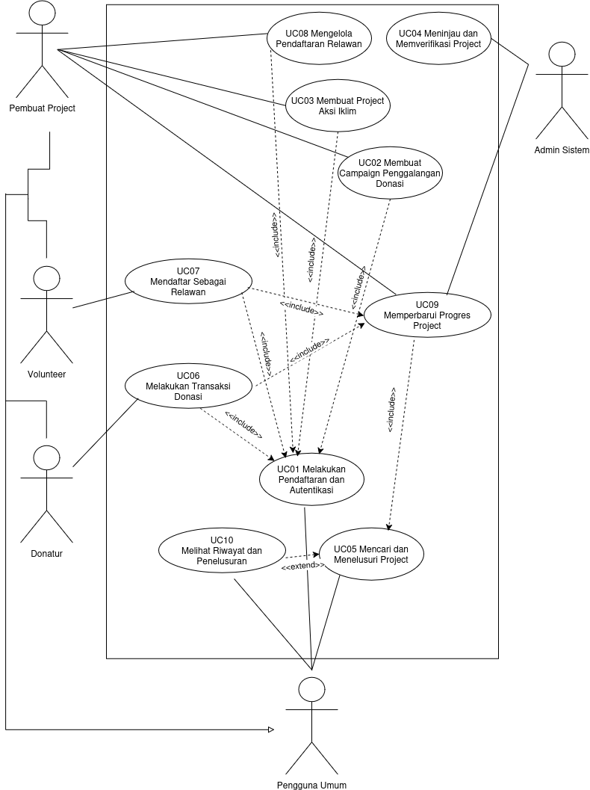

<h1>
IF2150 REKAYASA PERANGKAT LUNAK
 
TUGAS 5
 
SPESIFIKASI KEBUTUHAN PERANGKAT LUNAK (SKPL)
</h1>
 

## KlimPooL

### Untuk: Made Branenda Jordhy

Dipersiapkan oleh:
| Informasi | Keterangan |
| --- | --- |
| Kelas | 02 |
| Kelompok | 08  |

| NIM | Nama |
|---|---|
| 13525023 | Shaquille Nathan Kalevi |
| 13525080 | Neysa Alya Mukhbita |
| 13525092 | Bryan Pamungkas Prahara |
| 13525134 | Sahla Nailah Salsabilla |
| 13525140 | Nayla Putri Ghaisani |

---
## Daftar Perubahan

| Revisi | Deskripsi |
| :--- | :--- |
| *A* | *Deskripsikan perubahan yang dilakukan dari dokumen sebelumnya pada dokumen ini. Jika tidak terdapat perubahan, harap kosongkan tabel.* |
| *B* |  |
| *C* |  |
| ... |  |

 

# BAB 1: Pendahuluan

## 1.1 Tujuan Penulisan Dokumen
Dokumen Spesifikasi Kebutuhan Perangkat Lunak (SKPL) ini bertujuan untuk mendefinisikan secara komprehensif dan rinci seluruh kebutuhan fungsional, kebutuhan non-fungsional, batasan sistem, serta pemodelan perangkat lunak dari aplikasi KlimPooL. Dokumen ini berfungsi sebagai acuan teknis dan panduan utama bagi tim pengembang (Kelompok 08) dalam merancang, membangun, menguji, dan memelihara perangkat lunak agar sesuai dengan spesifikasi yang telah ditetapkan. Selain itu, dokumen ini juga ditujukan bagi evaluator atau pemberi tugas (Made Branenda Jordhy) serta pihak-pihak berkepentingan lainnya guna memastikan adanya pemahaman yang selaras mengenai ruang lingkup, alur kerja, dan fungsionalitas sistem secara menyeluruh sebelum tahap implementasi dilanjutkan.

## 1.2 Lingkup Masalah
KlimPooL adalah perangkat lunak berbasis web yang dirancang sebagai platform terpusat untuk mengoordinasikan aksi mitigasi perubahan iklim dan penanganan bencana alam. Aplikasi ini menjembatani pemilik project atau penggalang donasi dengan masyarakat luas yang ingin berkontribusi, baik melalui penyaluran dana finansial secara aman, penyediaan pasokan logistik, maupun pendaftaran sebagai relawan (volunteer) guna mewujudkan penanggulangan dampak iklim yang transparan dan terstruktur.

## 1.3 Definisi, Istilah, dan Singkatan
Semua definisi dan singkatan yang digunakan dalam dokumen ini beserta penjelasannya.

Tabel 1.3. Definisi Istilah dan Singkatan

| Singkatan, Akronim, atau Istilah | Penjelasan |
| :--- | :--- |
| *P/L* | *Singkatan dari Perangkat Lunak, yaitu aplikasi yang memberikan perintah kepada komputer untuk menjalankan tugas tertentu.* |
| *SKPL* | *Singkatan dari Spesifikasi Kebutuhan Perangkat Lunak, yaitu dokumen yang merangkum kriteria-kriteria yang diperlukan untuk membangun aplikasi menjalankan tugasnya.* |
| *KF* | *Singkatan dari Kebutuhan Fungsional.* |
| *KNF* | *Singkatan dari Kebutuhan Non-Fungsional.* |
| *UC* | *Singkatan dari Use Case.* |
| *TLS* | *Singkatan dari Transport Layer Security, yaitu sebuah protokol keamanan digital yang bertugas menyamarkan dan melindungi data saat dikirimkan melalui internet.*|
| *C* | *Singkatan dari Class/Kelas.* |

## 1.4 Aturan Penomoran
Tuliskan aturan penomoran (ID) yang digunakan dalam dokumen ini. Gunakan pola ID yang **sama** dengan yang sudah dipakai pada dokumen-dokumen sebelumnya, jangan membuat pola baru di dokumen ini.

Tabel 1.4. Aturan Penomoran

| Hal/Bagian | Penomoran | Keterangan |
| :--- | :--- | :--- |
| *Kebutuhan Fungsional* | *KFXX* | |
| *Kebutuhan Non-Fungsional* | *KNFXX* | |
| *Aktor* | *AXX* | |
| *Use Case* | *UCXX* | |
| *Kelas* | *CXX* | |
| *...* | *...* |

## 1.5 Referensi
- IPCC, 2023: Laporan Climate Change 2023: Synthesis Report dari Intergovernmental Panel on Climate Change. Tautan resmi: https://www.ipcc.ch/report/ar6/syr/
- Kasus Pencairan Gletser Nepal: Laporan kolaboratif Thame Valley Glacial Lake Outburst Flood 2024 dan identifikasi danau glasial oleh International Centre for Integrated Mountain Development (ICIMOD) bersama UNDP. Tautan publikasi: https://lib.icimod.org/records/8g9ze-1r153 dan https://www.undp.org/nepal/press-releases/report-icimod-and-undp-identifies-potentially-dangerous-glacial-lakes-koshi-gandaki-and-karnali-river-basins
- Tujuan Pembangunan Berkelanjutan (SDGs): Agenda resmi PBB Transforming our world: the 2030 Agenda for Sustainable Development yang merinci 17 target utama, termasuk Climate Action (SDG 13). Tautan resmi: https://sdgs.un.org/2030agenda
- Data Statistik Bencana Nasional: Portal Data Informasi Bencana Indonesia (DIBI) kelolaan Badan Nasional Penanggulangan Bencana (BNPB). Tautan resmi: https://dibi.bnpb.go.id/
- Analisis Tren Donasi Digital: Portal informasi dan repositori dari Perhimpunan Filantropi Indonesia yang merangkum dinamika donasi dan crowdfunding di tingkat nasional. Tautan resmi: https://filantropi.or.id/ aku ingin cara buka ini langsung ke informasi yang kita pake gimana
- Platform Crowdfunding Eksisting: PT Kita Bisa Indonesia. Kitabisa: Platform Galang Dana dan Donasi Online. Diakses melalui https://kitabisa.com/ (Sebagai rujukan analisis sistem donasi digital yang saat ini terfokus pada penggalangan dana moneter).
- Peta Interaktif Kerentanan Iklim: Kementerian Lingkungan Hidup dan Kehutanan (KemenLHK) Republik Indonesia. Sistem Informasi Data Indeks Kerentanan (SIDIK). Diakses melalui https://sidik.kemenlh.go.id/ (Sebagai purwarupa rujukan visual dan fungsional sistem pemetaan dampak lingkungan interaktif).
- Diagram UML: https://www.drawio.com/, https://staruml.io/

## 1.6 Deskripsi Umum Dokumen (Ikhtisar)
Dokumen Spesifikasi Kebutuhan Perangkat Lunak (SKPL) KlimPooL ini disusun dalam enam bab dengan sistematika sebagai berikut.

BAB 1 Pendahuluan membahas tujuan penulisan dokumen, lingkup masalah, definisi, istilah, dan singkatan, aturan penomoran, referensi, serta deskripsi umum dokumen.

BAB 2 Deskripsi Perangkat Lunak membahas deskripsi umum sistem dan alur kerjanya, deskripsi umum perangkat lunak beserta lingkup dan keterkaitannya dengan sistem lain, pengguna dan kebutuhan pengguna, batasan perangkat lunak, serta lingkungan operasi perangkat lunak.

BAB 3 Deskripsi Kebutuhan Perangkat Lunak membahas kebutuhan fungsional (KF) dan kebutuhan non-fungsional (KNF) yang harus dipenuhi perangkat lunak.

BAB 4 Pemodelan Use Case membahas identifikasi aktor, identifikasi use case, use case diagram, serta skenario normal dan alternatif untuk setiap use case.

BAB 5 Pemodelan Kelas membahas identifikasi kelas, diagram kelas untuk setiap use case, serta diagram kelas keseluruhan.

BAB 6 Traceability membahas keterkaitan antara kelas, use case, dan kebutuhan fungsional agar seluruh kebutuhan dapat ditelusuri sampai ke rancangannya.

---

# BAB 2: Deskripsi Perangkat Lunak

## 2.1 Deskripsi Umum Sistem

Sistem KlimPooL merupakan kesatuan antara perangkat lunak berbasis web, para penggunanya, serta rangkaian kegiatan aksi iklim yang berlangsung di dunia nyata. Perangkat lunak berperan sebagai penghubung yang mempertemukan pihak yang memiliki kebutuhan penanganan iklim dengan pihak yang memiliki kapasitas untuk membantu, baik dalam bentuk dana maupun tenaga. Kegiatan inti dari sistem ini, seperti penanaman kembali lahan kritis, distribusi logistik ke wilayah terdampak bencana, maupun kegiatan pemulihan lingkungan lainnya, tetap berlangsung di lapangan. Perangkat lunak hadir untuk mengoordinasikan kebutuhan, kontribusi, dan pelaporan dari kegiatan tersebut agar dapat ditelusuri secara terbuka oleh seluruh pihak yang terlibat.

Terdapat lima pihak yang berinteraksi dengan sistem, masing-masing dengan ekspektasi yang berbeda. Donatur mengharapkan kemudahan dalam menemukan kegiatan yang sesuai dengan kepeduliannya serta kepastian bahwa dana yang ia salurkan benar-benar dimanfaatkan sebagaimana dijanjikan. Volunteer mengharapkan informasi yang memadai mengenai jadwal, lokasi, tugas, dan keahlian yang dibutuhkan, sehingga ia dapat menilai kesesuaian sebelum mendaftarkan diri. Penggalang Donasi mengharapkan sarana untuk mengumpulkan dana secara terstruktur beserta target dan periode yang jelas. Pemilik Project mengharapkan sarana untuk menyatakan kebutuhan kegiatannya secara menyeluruh, mencakup dana, logistik, dan jumlah relawan, serta mengelola pendaftar yang masuk. Admin Sistem mengharapkan kendali yang memadai untuk menjaga agar hanya kegiatan yang layak dan terpercaya yang tayang di dalam sistem.

Alur kerja sistem dimulai ketika Penggalang Donasi atau Pemilik Project mendaftarkan kegiatannya beserta seluruh kebutuhan yang menyertainya. Pengajuan tersebut tidak langsung tayang, melainkan menunggu peninjauan Admin Sistem yang memeriksa kelayakan dan kejelasan informasi. Setelah disetujui, kegiatan muncul pada peta interaktif dan katalog sehingga dapat ditelusuri oleh publik berdasarkan wilayah maupun atribut lainnya. Dari titik tersebut, pengguna dapat memilih bentuk kontribusinya. Donatur menyalurkan dana melalui saldo yang tersedia di dalam aplikasi, di mana pengisian saldo diproses melalui gerbang pembayaran yang disimulasikan tanpa melibatkan perpindahan dana yang sebenarnya. Volunteer mengisi formulir pendaftaran yang selanjutnya ditinjau oleh Pemilik Project untuk disesuaikan dengan kebutuhan dan kapasitas kegiatan.

Setelah kontribusi terkumpul, kegiatan dilaksanakan di lapangan sesuai jadwal dan lokasi yang telah ditetapkan. Pada tahap inilah proses bisnis di dunia nyata berjalan, sementara perangkat lunak berperan mencatat perkembangannya. Pemilik Project memperbarui capaian, dokumentasi, dan laporan penggunaan dana secara berkala melalui sistem. Pembaruan tersebut kemudian dapat diakses oleh Donatur dan Volunteer yang mendukung kegiatan, sehingga rangkaian proses tertutup secara utuh dari pengajuan kebutuhan hingga pertanggungjawaban hasil.

Melalui penerapan sistem ini, diharapkan partisipasi masyarakat dalam aksi iklim tidak lagi terbatas pada pemberian dana, tetapi juga mencakup keterlibatan langsung sebagai relawan. Penyajian kegiatan berdasarkan wilayah diharapkan menumbuhkan kesadaran mengenai persoalan iklim yang terjadi di sekitar pengguna sekaligus mendorong keterlibatan pada isu yang paling dekat dengan mereka. Adanya pelaporan yang dapat ditelusuri juga diharapkan menumbuhkan kepercayaan publik, sehingga kesediaan masyarakat untuk berkontribusi pada penanganan perubahan iklim dapat terjaga secara berkelanjutan.

### Alur Kerja Sistem KlimPooL

| Tahap | Kegiatan | Pelaku | Ditangani |
| :--- | :--- | :--- | :--- |
| 1 | Pengajuan campaign atau project beserta kebutuhannya | Penggalang Donasi, Pemilik Project | Aplikasi |
| 2 | Peninjauan kelayakan pengajuan | Admin Sistem | Aplikasi |
| 3 | Publikasi pada peta interaktif dan katalog | Sistem | Aplikasi |
| 4a | Penyaluran donasi melalui saldo internal | Donatur | Aplikasi |
| 4b | Pendaftaran sebagai relawan dan peninjauannya | Volunteer, Pemilik Project | Aplikasi |
| 5 | Pelaksanaan kegiatan sesuai jadwal dan lokasi | Pemilik Project, Volunteer | Lapangan |
| 6 | Pembaruan progres dan laporan penggunaan dana | Pemilik Project | Aplikasi |

<i>Gambar 1. Activity Diagram 1 (Alur Donasi Dana)</i>

<i>Gambar 2. Activity Diagram 2 (Alur Pendaftaran & Aktivitas Volunteer)</i>

## 2.2 Deskripsi Umum Perangkat Lunak
# KlimPooL

KlimPooL merupakan aplikasi berbasis web yang menghubungkan masyarakat dengan kegiatan aksi iklim dan penanganan bencana di berbagai wilayah Indonesia melalui peta interaktif. Melalui peta tersebut, pengguna dapat menelusuri kegiatan di wilayah tertentu, membaca kebutuhan yang belum terpenuhi, lalu berkontribusi dalam bentuk dana atau tenaga sebagai relawan. Setiap pengguna juga dapat menginisiasi penggalangan dana atau rekrutmen relawan untuk kegiatannya sendiri. Seluruh pengajuan diverifikasi oleh Admin Sistem sebelum dipublikasikan.

Perangkat lunak ini mendukung proses bisnis pada sub-bab 2.1, yaitu pengajuan campaign dan project, verifikasi, publikasi pada peta dan katalog, penyaluran donasi, pendaftaran dan seleksi relawan, serta pelaporan progres dan penggunaan dana. Sistem menerima masukan dari empat aktor melalui antarmuka web, yaitu Pembuat Project, Donatur, Volunteer, dan Admin Sistem. Setiap pengguna memiliki dua jenis saldo yang terpisah: saldo pribadi untuk berdonasi, dan saldo penggalangan dana yang menampung donasi masuk pada kegiatan yang ia buka. Seluruh data akun, campaign, project, saldo, transaksi, pendaftaran relawan, dan riwayat progres disimpan pada basis data internal sistem.

Lingkup perangkat lunak mencakup:

1. Pendaftaran akun dan autentikasi pengguna.
2. Pembuatan campaign penggalangan donasi dan project aksi iklim.
3. Peninjauan dan verifikasi pengajuan oleh Admin Sistem.
4. Pencarian dan penelusuran kegiatan melalui peta interaktif dan katalog.
5. Transaksi donasi berbasis saldo di dalam aplikasi.
6. Pendaftaran dan pengelolaan relawan.
7. Pembaruan progres dan dokumentasi kegiatan.
8. Penelusuran riwayat transaksi dan progres.

KlimPooL tidak terhubung dengan sistem eksternal, baik lembaga keuangan maupun basis data lembaga lain. Data kegiatan yang ditampilkan merupakan data tiruan yang disusun tim pengembang. Pengisian saldo pengguna hanya disimulasikan di dalam aplikasi, layaknya *Payment Gateway* (dummy), sehingga tidak ada perpindahan dana yang nyata. Ketika Donatur mengonfirmasi donasi, sistem memvalidasi saldo, mengurangi saldo Donatur, menambahkan dana ke saldo tujuan, dan mencatat transaksi dalam satu *database transaction* yang bersifat atomik. Bila salah satu tahap gagal, seluruh perubahan dibatalkan.

Di luar lingkup perangkat lunak terdapat pelaksanaan kegiatan di lapangan (penanaman, distribusi logistik, pemulihan lingkungan), pengelolaan logistik fisik, dan penjadwalan kegiatan yang terperinci. Perangkat lunak hanya mencatat, mengoordinasikan, dan melaporkan kegiatan tersebut. Cakupan wilayah terbatas pada Indonesia, dan materi edukasi mitigasi iklim tidak termasuk dalam tahap ini.

## 2.3 Pengguna dan Kebutuhan Pengguna Perangkat Lunak

| Pengguna | Kebutuhan |
| :--- | :--- |
| *Pembuat Project* | *Pengguna harus dapat menciptakan, mengelola, dan menjalankan climate action project dengan sistem sebagai sarana untuk mengelola serta menyampaikan perkembangan project.* |
| *Donatur* | *Pengguna harus dapat memberikan dana untuk mendukung climate action project melalui sistem dengan mengutamakan transparansi penggunaan dana, keamanan transaksi, dan kemudahan dalam berdonasi.* |
| *Volunteer* | *Pengguna harus dapat memberikan kontribusi secara langsung dalam pelaksanaan climate action project melalui waktu, tenaga, atau keahliannya dengan sistem sebagai sarana kebutuhan informasi project, jadwal, lokasi, dan proses pendaftaran yang jelas dan mudah.* |
| *Admin Sistem* | *Pengguna harus mengelola dan mengawasi keberjalanan sistem, termasuk memverifikasi pengguna dan project yang terdaftar dengan mengutamakan keamanan, validitas data, dan keteraturan sistem.* |

## 2.4 Batasan Perangkat Lunak
Batasan yang berlaku pada pengembangan P/L ini, di antaranya:
1. P/L harus berupa aplikasi berbasis web yang dapat dijalankan melalui peramban modern (Chrome, Firefox, Edge, atau Safari versi terkini) tanpa pemasangan perangkat lunak tambahan pada perangkat pengguna.
2. P/L harus memakai antarmuka gerbang pembayaran tiruan (*dummy payment gateway*) untuk proses pengisian saldo, serta tidak boleh memproses transaksi keuangan secara mandiri maupun terhubung ke penyedia layanan pembayaran yang sebenarnya.
3. P/L harus memakai format data JSON melalui protokol HTTP dalam pertukaran data dengan gerbang pembayaran tiruan dan layanan unggah dokumentasi progres.
4. P/L harus memakai data tiruan yang disusun oleh tim untuk data project, campaign, dan pengguna, serta tidak terhubung ke basis data lembaga eksternal seperti BNPB maupun SIDIK Kementerian Lingkungan Hidup dan Kehutanan.
5. P/L harus memperlakukan nominal saldo pengguna dan dana project sebagai data simulasi yang tidak merepresentasikan nilai keuangan sebenarnya.
6. P/L harus menyimpan kata sandi pengguna menggunakan algoritma *password hashing* Argon2id atau bcrypt, serta tidak boleh menyimpannya dalam bentuk *plaintext* maupun dengan fungsi hash tanpa *salt*.
7. P/L harus mengirimkan seluruh data antara peramban pengguna dan server melalui HTTPS dengan TLS minimum versi 1.2.
8. P/L harus memproses dan menyimpan data pribadi pengguna sesuai Undang-Undang Nomor 27 Tahun 2022 tentang Pelindungan Data Pribadi.
9. P/L harus mewajibkan setiap campaign dan project melewati verifikasi Admin Sistem sebelum dipublikasikan, serta tidak menyediakan mekanisme penyaluran donasi tanpa akun terdaftar.
10. P/L harus membatasi cakupan data lokasi kegiatan pada wilayah administratif Republik Indonesia, sehingga peta interaktif tidak menampilkan kegiatan di luar teritori tersebut.
11. P/L tidak menangani aspek operasional kegiatan di lapangan, seperti pengelolaan logistik fisik dan penjadwalan kegiatan secara terperinci, karena hal tersebut menjadi tanggung jawab Pemilik Project di luar sistem.
12. P/L tidak menyajikan materi edukasi mitigasi iklim pada tahap pengembangan ini, dan penyajiannya dipertimbangkan sebagai pengembangan lanjutan.

## 2.5 Lingkungan Operasi Perangkat Lunak

| Komponen | Spesifikasi |
| :--- | :--- |
| *Server* | P/L harus dijalankan pada server yang tersedia secara berkelanjutan dan mampu melayani permintaan pengguna secara bersamaan. Teknologi dan versi *runtime*, serta penyedia layanan *hosting*, akan ditentukan pada tahap implementasi. |
| *Client* | P/L dapat diakses melalui peramban web versi terkini, seperti Chrome, Firefox, Edge, atau Safari, pada perangkat desktop, tablet, maupun *smartphone* tanpa pemasangan perangkat lunak tambahan. Pengguna harus memiliki koneksi internet yang memadai. |
| *DBMS* | P/L harus menyimpan data akun, campaign, project, saldo, transaksi, pendaftaran relawan, dan riwayat progres pada basis data internal. DBMS yang digunakan harus mendukung transaksi atomik (*ACID*) untuk pemrosesan donasi. Jenis dan versi DBMS akan ditentukan pada tahap implementasi. |
| *OS Client* | P/L dapat diakses melalui sistem operasi apa pun yang mendukung peramban web modern, sehingga pengguna tidak dibatasi pada sistem operasi tertentu. |
| *OS Server* | Sistem operasi server akan ditentukan sesuai dengan teknologi *runtime* dan lingkungan *hosting* yang dipilih pada tahap implementasi. |
| *Jaringan dan Protokol* | Komunikasi antara peramban dan server harus menggunakan HTTPS dengan TLS versi 1.2 atau lebih tinggi. Pertukaran data melalui API harus menggunakan format JSON. |
| *Kapasitas Operasional* | Server harus mendukung 1.000 pengguna aktif secara simultan dengan waktu tanggap maksimal 3 detik untuk setiap permintaan. Ketersediaan layanan harus mencapai minimal 99% per bulan, di luar jadwal pemeliharaan rutin. |

---

# BAB 3: Deskripsi Kebutuhan Perangkat Lunak

## 3.1 Kebutuhan Fungsional (KF)

Tabel 3.1. Kebutuhan Fungsional

| ID KF | ID Kebutuhan | Penjelasan |
| :--- | :--- | :--- |
| *KF01* | *R01* | *Ketika pengguna melakukan pendaftaran akun, sistem harus menyediakan fitur pengisian data dan data tersebut digunakan untuk login.* |
| *KF02* | *R03* | *Bila email yang dimasukkan sudah pernah digunakan, maka sistem harus menampilkan pesan kesalahan dan menolak pendaftaran.* |
| *KF03* | *R04* | *Sistem harus menyimpan password pengguna menggunakan algoritma password hashing seperti Argon2id atau bcrypt.* |
| *KF04* | *R05* | *Selama pengguna mengakses fitur yang membutuhkan autentikasi, sistem harus memastikan pengguna berada dalam status telah login.* |
| *KF05* | *R07* | *Sistem harus menyediakan fitur pembuatan campaign Penggalangan Donasi yang memuat judul, deskripsi, target dana, periode penggalangan, dan informasi penggunaan dana.* |
| *KF06* | *R09, R15* | *Sistem harus menyimpan data campaign atau project beserta informasi pembuatnya dan memberikan status verifikasi (draft, pending verification, published, atau rejected).* |
| *KF07* | *R10* | *Bila nilai target dana bernilai negatif/kosong atau rentang waktu periode tidak valid, maka sistem harus menolak pembuatan campaign.* |
| *KF08* | *R11* | *Sistem harus menyediakan fitur pembuatan campaign project aksi iklim yang memuat deskripsi kegiatan, lokasi, jadwal, kebutuhan dana, kebutuhan logistik, jumlah volunteer, dan keahlian yang dibutuhkan.* |
| *KF09* | *R13* | *Sistem harus menyimpan informasi project dan menghubungkannya dengan akun Pembuat Project yang membuatnya.* |
| *KF10* | *R14* | *Bila jadwal atau lokasi kosong atau nilai kebutuhan bernilai negatif, maka sistem harus menolak pembuatan project.* |
| *KF11* | *R17* | *Ketika peninjauan project selesai dilakukan, sistem harus memperbarui status verifikasi (diterima atau ditolak) beserta alasannya.* |
| *KF12* | *R18* | *Selama pengguna bukan Admin Sistem, sistem harus melarang akses ke fungsi peninjauan dan verifikasi.* |
| *KF13* | *R21* | *Sistem harus menyediakan fungsi pencarian dan penyaringan campaign atau project berdasarkan atribut seperti kategori, lokasi, status, atau periode kegiatan.* |
| *KF14* | *R19, R20, R22* | *Selama pengguna berstatus pengguna umum (Donatur dan Volunteer), sistem harus menampilkan hanya campaign dan project yang berstatus telah di publikasikan beserta informasi lengkapnya.* |
| *KF15* | *R23, R26* | *Ketika Donatur mengirimkan permintaan donasi, sistem harus memvalidasi saldo, mengurangi saldo Donatur, menambahkan dana ke saldo tujuan, serta mencatat transaksi dalam satu proses yang konsisten.* |
| *KF16* | *R27* | *Bila terjadi kegagalan pada salah satu tahap transaksi donasi, maka sistem harus membatalkan seluruh perubahan saldo dan pencatatan transaksi (atomic rollback & consistency).* |
| *KF17* | *R28* | *Ketika transaksi berhasil diproses, sistem harus membuat ID transaksi unik dan menyimpan riwayat transaksi yang mencakup Donatur, tujuan dana, nominal, waktu, dan status transaksi.* |
| *KF18* | *R29* | *Bila permintaan donasi menggunakan idempotency key yang sudah terdaftar, maka sistem harus menolak pemrosesan transaksi berulang.* |
| *KF19* | *R30, R32* | *Bila pengguna mengirimkan pendaftaran lebih dari satu kali pada project yang sama atau data formulir tidak lengkap (data diri, keahlian, pengalaman, dan ketersediaan jadwal), maka sistem harus menolak pengiriman pendaftaran.* |
| *KF20* | *R33, R34* | *Ketika pengguna mengirimkan pendaftaran volunteer, sistem harus menyimpan data pendaftaran dan status pendaftaran (pending, accepted, atau rejected).* |
| *KF21* | *R35, R37* | *Ketika Pembuat Project menyimpan keputusan pendaftaran, sistem harus memperbarui status pendaftaran volunteer secara otomatis.* |
| *KF22* | *R38* | *Ketika status pendaftaran diperbarui, sistem harus menampilkan informasi status penerimaan atau penolakan kepada pengguna, dan jika diterima, menampilkan instruksi lokasi serta jadwal kegiatan.* |
| *KF23* | *R39, R41* | *Ketika pembaruan progres disimpan, sistem harus mencatat data pembaruan beserta waktu pembaruan agar perkembangan project dapat ditelusuri.* |
| *KF24* | *R42* | *Sistem harus menyediakan API untuk mengunggah dan mengambil dokumentasi progres serta menghubungkannya dengan project terkait.* |
| *KF25* | *R43* | *Bila pengguna yang mencoba mengubah progres project bukan Pembuat Project terkait atau Admin Sistem, maka sistem harus menolak hak perubahan tersebut.* |
| *KF26* | *R47* | *Ketika transaksi baru berhasil diproses, sistem harus menghitung dan memperbarui total dana terkumpul serta persentase pencapaian target secara otomatis.* |
| *KF27* | *R44, R45, R48* | *Sistem harus menyediakan riwayat transaksi dan perubahan progres yang dapat ditelusuri berdasarkan waktu dan aktivitas yang dilakukan.* |

## 3.2 Kebutuhan Non-Fungsional (KNF)

Tabel 3.2. Kebutuhan Non-Fungsional

| ID KNF | ID Kebutuhan | Parameter (ISO 25010:2023) | Deskripsi Kebutuhan |
|---|---|---|---|
| KNF01 | R01, R19 | Flexibility | Ketika diakses melalui perangkat *desktop*, *tablet*, maupun *smartphone*, sistem harus menyesuaikan tata letak antarmuka secara otomatis. |
| KNF02 | R04, R05, R06 | Performance efficiency | Ketika pengguna menerapkan filter pencarian pada kondisi jaringan stabil, sistem harus menampilkan hasil akhir dalam waktu $\le3$ detik. |
| KNF03 | R11, R12 | Interaction capability | Sistem harus memfasilitasi pengguna untuk menyelesaikan keseluruhan alur pemesanan jasa hingga pembayaran maksimal dalam 5 langkah antarmuka. |
| KNF04 | R12, R13, R42 | Reliability | Bila terjadi pemutusan jaringan saat transaksi berlangsung, maka sistem harus mengeksekusi *rollback* secara otomatis. |
| KNF05 | R14, R18 | Security | Sistem harus mengenkripsi kredensial kata sandi dengan bcrypt dan memproteksi transmisi data minimum menggunakan TLS 1.2. |
| KNF06 | R36, R37 | Reliability | Sistem harus memastikan ketersediaan akses fungsional (*uptime*) minimal 99% per bulan, di luar jadwal pemeliharaan rutin. |
| KNF07 | R20, R22 | Performance efficiency | Ketika pengguna memicu unggahan berkas portofolio (JPG, PNG, PDF, MP4, atau ZIP), sistem harus memproses berkas tersebut dengan kapasitas hingga 50 MB per berkas. |
| KNF08 | R10, R26 | Performance efficiency | Ketika pesan *chat* baru atau notifikasi status pesanan dipicu, sistem harus menampilkannya ke antarmuka penerima dalam waktu $\le2$ detik. |
| KNF09 | Umum | Performance efficiency | Selama sistem menerima beban 1.000 pengguna aktif secara simultan, sistem harus mempertahankan waktu tanggap maksimal 3 detik per permintaan. |
| KNF10 | R18 | Constraint | Sistem harus memproses dan menyimpan data pengguna sesuai Undang-Undang Perlindungan Data Pribadi (UU PDP). |
| KNF11 | Umum | Maintainability | Sistem harus mengadopsi arsitektur modular sehingga penambahan kategori jasa sekunder tidak memicu modifikasi ulang pada komponen modul transaksi utama. |

*Silakan pilih parameter yang relevan dengan P/L kalian (Availability, Reliability, Ergonomy, Portability, Memory, Response time, Safety, Security, dsb), tidak perlu semua parameter diisi. Lihat kembali dokumen Requirement Gathering untuk penjelasan tiap parameter.*

---

# BAB 4: Pemodelan Use Case

## 4.1 Identifikasi Aktor

| ID Aktor | Aktor | Deskripsi |
| :--- | :--- | :--- |
| A01 | *Pembuat Project* | *Pengguna ini bertindak sebagai pihak yang menciptakan, mengelola, dan menjalankan climate action project pada lokasi tertentu. Karakteristik dari pengguna ini adalah memiliki tujuan project yang jelas dan membutuhkan sarana untuk mengelola serta menyampaikan perkembangan project.* |
| A02 | *Donatur* | *Pengguna ini bertindak sebagai pihak yang memberikan dana untuk mendukung climate action project melalui sistem. Karakteristik dari pengguna ini adalah mengutamakan transparansi penggunaan dana, keamanan transaksi, dan kemudahan dalam berdonasi.* |
| A03 | *Volunteer* | *Pengguna ini bertindak sebagai pihak yang memberikan kontribusi secara langsung dalam pelaksanaan climate action project melalui waktu, tenaga, atau keahliannya. Karakteristik dari pengguna ini adalah membutuhkan informasi project, jadwal, lokasi, dan proses pendaftaran yang jelas dan mudah.* |
| A04 | *Admin Sistem* | *Pengguna ini bertindak sebagai pihak yang mengelola dan mengawasi keberjalanan sistem, termasuk memverifikasi pengguna dan project yang terdaftar. Karakteristik dari pengguna ini adalah mengutamakan keamanan, validitas data, dan keteraturan sistem.* |

## 4.2 Identifikasi Use Case

| ID UC | Nama Use Case | Deskripsi Singkat | Aktor | ID KF |
| :--- | :--- | :--- | :--- | :--- |
| UC01 | Melakukan Pendaftaran dan Autentikasi | Pengguna mendaftarkan akun baru dengan validasi ketersediaan email, dan sistem mengelola keamanan password serta status login. | Pengguna Umum (Pembuat Project, Donatur, Volunteer) | KF01, KF02, KF03, KF04 |
| UC02 | Membuat Campaign Penggalangan Donasi | Pembuat Project merancang campaign penggalangan dana dengan menetapkan target nominal dan periode waktu yang valid. | Pembuat Project | KF05, KF06, KF07 |
| UC03 | Membuat Project Aksi Iklim | Pembuat Project mendaftarkan project aksi iklim beserta informasi kebutuhan dana, logistik, dan kriteria relawan. | Pembuat Project | KF08, KF09, KF10 |
| UC04 | Meninjau dan Memverifikasi Project | Admin meninjau pengajuan campaign atau project yang masuk dan memperbarui status verifikasinya (diterima/ditolak). | Pembuat Project, Admin Sistem | KF11, KF12 |
| UC05 | Mencari dan Menelusuri Project | Pengguna mencari, menyaring, dan melihat detail informasi campaign atau project yang berstatus telah dipublikasikan. | Pengguna Umum (Pembuat Project, Donatur, Volunteer) | KF13, KF14 |
| UC06 | Melakukan Transaksi Donasi | Donatur mengirimkan dana donasi yang diproses secara konsisten (atomic), mencegah duplikasi, dan otomatis memperbarui total dana campaign. | Donatur | KF15, KF16, KF17, KF18, KF26 |
| UC07 | Mendaftar Sebagai Volunteer | Pengguna mendaftar menjadi volunteer pada project aksi iklim dengan melengkapi data diri dan keahlian secara lengkap. | Volunteer | KF19, KF20 |
| UC08 | Mengelola Pendaftaran Relawan | Pembuat Project meninjau pendaftaran volunteer, memberikan keputusan (terima/tolak), dan sistem menampilkan instruksi kegiatan. | Pembuat Project | KF21, KF22 |
| UC09 | Memperbarui Progres Project | Pembuat Project atau Admin mengunggah pembaruan kegiatan dan dokumentasi progres yang terhubung langsung dengan project. | Pembuat Project, Admin Sistem | KF23, KF24, KF25 |
| UC10 | Melihat Riwayat dan Penelusuran | Pengguna mengakses riwayat lengkap terkait transaksi donasi dan melacak perubahan progres project berdasarkan urutan waktu. | Pengguna Umum (Pembuat Project, Donatur, Volunteer) | KF27 |

## 4.3 Use Case Diagram

 

<i>Gambar 2. Use Case Diagram</i>

 

## 4.4 Skenario Use Case
Salin ulang skenario **setiap** use case (skenario normal dan alternatif) dari BAB 3.4 dokumen *Use Case & Scenario Use Case*, sesuaikan dengan daftar UC final pada 4.2. Jika use case melibatkan lebih dari satu aktor manusia yang benar-benar berinteraksi langsung (misalnya *Kasir* yang memverifikasi transaksi setelah *Pelanggan* membayar), tambahkan kolom aksi tersendiri untuk aktor tersebut di samping kolom "Reaksi Perangkat Lunak". Sistem eksternal otomatis seperti *payment gateway* **bukan aktor**, sehingga interaksinya cukup dituliskan sebagai bagian dari "Reaksi Perangkat Lunak", bukan kolom aktor terpisah.

### 4.4.1 Skenario UC01

**Nama Use Case: Melakukan Pendaftaran dan Autentikasi**

#### Skenario Normal

**Precondition:** Pengguna Umum belum memiliki akun atau belum melakukan login.

**Postcondition:** Pengguna Umum berhasil memiliki akun dan masuk ke dalam sistem.

| No | Pengguna Umum (Pembuat Project, Donatur, Volunteer) | Reaksi P/L |
| :--- | :--- | :--- |
| 1 | Memilih menu pendaftaran | |
| 2 | | Sistem menampilkan formulir pendaftaran |
| 3 | Mengisi nama, email, dan password | |
| 4 | | Sistem memvalidasi kelengkapan dan format input |
| 5 | | Sistem memeriksa ketersediaan email |
| 6 | | Sistem menyimpan data akun dan password |
| 7 | Memasukkan email dan password pada halaman login | |
| 8 | | Sistem memvalidasi kredensial pengguna |
| 9 | | Sistem membuat sesi login dan mengarahkan pengguna ke halaman utama |

#### Skenario Alternatif 1: Email Sudah Terdaftar

**Precondition:** Pengguna Umum berada pada halaman pendaftaran dan email yang digunakan telah terdaftar.

**Postcondition:** Akun baru tidak dibuat dan pengguna diminta menggunakan email lain atau melakukan login.

| No | Pengguna Umum (Pembuat Project, Donatur, Volunteer) | Reaksi P/L |
| :--- | :--- | :--- |
| 1 | Mengisi formulir pendaftaran menggunakan email yang sudah terdaftar | |
| 2 | | Sistem mendeteksi bahwa email telah digunakan |
| 3 | | Sistem menampilkan pesan bahwa email sudah terdaftar |
| 4 | Memperbaiki email atau memilih menu login | |
| 5 | | Sistem menampilkan kembali formulir pendaftaran atau mengarahkan pengguna ke halaman login |

#### Skenario Alternatif 2: Kredensial Login Tidak Valid

**Precondition:** Pengguna Umum telah memiliki akun dan berada pada halaman login.

**Postcondition:** Pengguna Umum tetap berada pada halaman login dan belum mendapatkan sesi login.

| No | Pengguna Umum (Pembuat Project, Donatur, Volunteer) | Reaksi P/L |
| :--- | :--- | :--- |
| 1 | Memasukkan email atau password yang salah | |
| 2 | | Sistem menolak kredensial dan menampilkan pesan bahwa email atau password tidak valid |
| 3 | Memasukkan kembali email dan password | |
| 4 | | Sistem kembali melakukan validasi kredensial |

---

### 4.4.2 Skenario UC02

**Nama Use Case: Membuat Campaign Penggalangan Donasi**

#### Skenario Normal

**Precondition:** Pembuat Project telah login ke dalam sistem.

**Postcondition:** Campaign berhasil dibuat dan tersimpan dengan status "Menunggu Verifikasi".

| No | Pembuat Project | Reaksi P/L |
| :--- | :--- | :--- |
| 1 | Memilih menu membuat campaign penggalangan donasi | |
| 2 | | Sistem menampilkan formulir pembuatan campaign |
| 3 | Mengisi judul, deskripsi, target nominal, dan periode campaign | |
| 4 | | Sistem memvalidasi kelengkapan dan format data campaign |
| 5 | Mengirimkan formulir campaign | |
| 6 | | Sistem memeriksa validitas target nominal dan periode campaign |
| 7 | | Sistem menyimpan campaign dengan status "Menunggu Verifikasi" |
| 8 | Membuka halaman campaign yang telah dibuat | |
| 9 | | Sistem menampilkan informasi campaign beserta status verifikasinya |

#### Skenario Alternatif 1: Data Campaign Tidak Lengkap

**Precondition:** Pembuat Project berada pada formulir pembuatan campaign.

**Postcondition:** Campaign belum dibuat dan Pembuat Project diminta melengkapi data yang diperlukan.

| No | Pembuat Project | Reaksi P/L |
| :--- | :--- | :--- |
| 1 | Mengirimkan formulir dengan data yang belum lengkap | |
| 2 | | Sistem mendeteksi data yang belum lengkap |
| 3 | | Sistem menampilkan pesan kesalahan pada bagian yang belum lengkap |
| 4 | Melengkapi data campaign | |
| 5 | | Sistem kembali melakukan validasi terhadap data campaign |

#### Skenario Alternatif 2: Target atau Periode Campaign Tidak Valid

**Precondition:** Pembuat Project telah mengisi formulir campaign, tetapi target nominal atau periode campaign tidak valid.

**Postcondition:** Campaign belum dibuat sampai data yang tidak valid diperbaiki.

| No | Pembuat Project | Reaksi P/L |
| :--- | :--- | :--- |
| 1 | Memasukkan target nominal atau periode campaign yang tidak valid | |
| 2 | | Sistem mendeteksi data yang tidak valid |
| 3 | | Sistem menampilkan pesan kesalahan dan bagian yang perlu diperbaiki |
| 4 | Memperbaiki target nominal atau periode campaign | |
| 5 | | Sistem kembali melakukan validasi terhadap data yang diperbaiki |

---

### 4.4.3 Skenario UC03

**Nama Use Case: Membuat Project Aksi Iklim**

#### Skenario Normal

**Precondition:** Pembuat Project telah login ke dalam sistem.

**Postcondition:** Project aksi iklim berhasil dibuat dan tersimpan dengan status "Menunggu Verifikasi".

| No | Pembuat Project | Reaksi P/L |
| :--- | :--- | :--- |
| 1 | Memilih menu membuat project aksi iklim | |
| 2 | | Sistem menampilkan formulir pembuatan project |
| 3 | Mengisi nama, deskripsi, lokasi, dan tujuan project | |
| 4 | | Sistem menampilkan informasi project yang telah dimasukkan |
| 5 | Mengisi kebutuhan dana, logistik, dan kriteria volunteer | |
| 6 | | Sistem memvalidasi kelengkapan data kebutuhan project |
| 7 | Mengirimkan formulir project | |
| 8 | | Sistem menyimpan project dengan status "Menunggu Verifikasi" |
| 9 | Membuka halaman project yang telah dibuat | |
| 10 | | Sistem menampilkan informasi project beserta status verifikasinya |

#### Skenario Alternatif 1: Informasi Project Tidak Lengkap

**Precondition:** Pembuat Project berada pada formulir pembuatan project.

**Postcondition:** Project belum dibuat dan Pembuat Project diminta melengkapi informasi yang diperlukan.

| No | Pembuat Project | Reaksi P/L |
| :--- | :--- | :--- |
| 1 | Mengirimkan formulir dengan informasi project yang belum lengkap | |
| 2 | | Sistem mendeteksi informasi yang belum lengkap |
| 3 | | Sistem menampilkan pesan kesalahan dan bagian yang perlu dilengkapi |
| 4 | Melengkapi informasi project | |
| 5 | | Sistem kembali melakukan validasi terhadap informasi project |

#### Skenario Alternatif 2: Data Kebutuhan Project Tidak Valid

**Precondition:** Pembuat Project telah mengisi kebutuhan dana, logistik, atau kriteria volunteer.

**Postcondition:** Project belum dibuat sampai data kebutuhan diperbaiki.

| No | Pembuat Project | Reaksi P/L |
| :--- | :--- | :--- |
| 1 | Mengisi data kebutuhan project yang tidak sesuai | |
| 2 | | Sistem mendeteksi data kebutuhan yang tidak valid |
| 3 | | Sistem menampilkan pesan kesalahan pada data yang tidak valid |
| 4 | Memperbaiki data kebutuhan project | |
| 5 | | Sistem kembali melakukan validasi terhadap data yang diperbaiki |

---

### 4.4.4 Skenario UC04

**Nama Use Case: Meninjau dan Memverifikasi Project**

#### Skenario Normal

**Precondition:** Pembuat Project telah mengirimkan campaign atau project dan statusnya "Menunggu Verifikasi".

**Postcondition:** Campaign atau project telah diverifikasi dan berstatus "Diterima" serta dapat dipublikasikan.

| No | Pembuat Project | Admin Sistem | Reaksi P/L |
| :--- | :--- | :--- | :--- |
| 1 | Mengirimkan campaign atau project untuk diverifikasi | | |
| 2 | | | Sistem menyimpan pengajuan dengan status "Menunggu Verifikasi" |
| 3 | | Membuka halaman daftar pengajuan | |
| 4 | | | Sistem menampilkan daftar campaign dan project yang menunggu verifikasi |
| 5 | | Memilih salah satu campaign atau project | |
| 6 | | | Sistem menampilkan detail campaign atau project |
| 7 | | Memeriksa kelengkapan dan validitas informasi | |
| 8 | | Menyetujui campaign atau project | |
| 9 | | | Sistem mengubah status menjadi "Diterima" dan mempublikasikan campaign atau project |
| 10 | | | Sistem menampilkan status campaign atau project sebagai "Diterima" |

#### Skenario Alternatif 1: Campaign atau Project Ditolak

**Precondition:** Terdapat campaign atau project yang berstatus "Menunggu Verifikasi" dan tidak memenuhi persyaratan.

**Postcondition:** Campaign atau project berstatus "Ditolak" dan alasan penolakan tersimpan.

| No | Pembuat Project | Admin Sistem | Reaksi P/L |
| :--- | :--- | :--- | :--- |
| 1 | Mengirimkan campaign atau project untuk diverifikasi | | |
| 2 | | | Sistem menyimpan pengajuan dengan status "Menunggu Verifikasi" |
| 3 | | Membuka dan memilih pengajuan | |
| 4 | | | Sistem menampilkan detail campaign atau project |
| 5 | | Menolak campaign atau project dan memberikan alasan | |
| 6 | | | Sistem menyimpan alasan penolakan dan mengubah status menjadi "Ditolak" |
| 7 | | | Sistem menampilkan status campaign atau project sebagai "Ditolak" |

---

### 4.4.5 Skenario UC05

**Nama Use Case: Mencari dan Menelusuri Project**

#### Skenario Normal

**Precondition:** Terdapat campaign atau project yang telah dipublikasikan.

**Postcondition:** Pengguna berhasil menemukan dan melihat detail campaign atau project yang dipilih.

| No | Pengguna Umum (Pembuat Project, Donatur, Volunteer) | Reaksi P/L |
| :--- | :--- | :--- |
| 1 | Membuka halaman daftar project | |
| 2 | | Sistem menampilkan daftar campaign dan project yang telah dipublikasikan |
| 3 | Memasukkan kata kunci atau memilih filter | |
| 4 | | Sistem memproses kata kunci dan filter yang dipilih |
| 5 | | Sistem menampilkan hasil pencarian yang sesuai |
| 6 | Memilih salah satu campaign atau project | |
| 7 | | Sistem menampilkan detail campaign atau project |
| 8 | Melihat informasi campaign atau project | |
| 9 | | Sistem menampilkan deskripsi, kebutuhan, target donasi, lokasi, dan status project |

#### Skenario Alternatif 1: Project Tidak Ditemukan

**Precondition:** Pengguna Umum berada pada halaman pencarian project.

**Postcondition:** Tidak ada project yang sesuai dengan kriteria pencarian dan pengguna dapat melakukan pencarian kembali.

| No | Pengguna Umum (Pembuat Project, Donatur, Volunteer) | Reaksi P/L |
| :--- | :--- | :--- |
| 1 | Memasukkan kata kunci atau filter tertentu | |
| 2 | | Sistem melakukan pencarian berdasarkan kata kunci atau filter |
| 3 | | Sistem tidak menemukan campaign atau project yang sesuai |
| 4 | | Sistem menampilkan pesan bahwa project yang sesuai tidak ditemukan |
| 5 | Mengubah kata kunci atau filter pencarian | |
| 6 | | Sistem menampilkan hasil pencarian berdasarkan kriteria baru |

---

### 4.4.6 Skenario UC06

**Nama Use Case: Melakukan Transaksi Donasi**

#### Skenario Normal

**Precondition:** Donatur telah login dan terdapat campaign/project iklim yang aktif menerima donasi.

**Postcondition:** Donasi berhasil diproses, saldo Donatur berkurang sesuai nominal donasi, dan bukti transaksi ditampilkan.

| No | Donatur | Reaksi Perangkat Lunak |
| :--- | :--- | :--- |
| 1 | Donatur melihat campaign / project yang ingin didukung melalui peta wilayah | |
| 2 | | Sistem memastikan Donatur telah login dan menampilkan project iklim yang tersebar di peta wilayah |
| 3 | Donatur menekan tombol donasi | |
| 4 | | Sistem menampilkan formulir masukan nominal donasi beserta saldo Donatur yang tersedia |
| 5 | Donatur memasukkan nominal donasi | |
| 6 | Donatur mengonfirmasi pembayaran | |
| 7 | | Sistem memvalidasi kelayakan saldo dan mengirimkan permintaan donasi untuk dikonfirmasi |
| 8 | | Sistem menampilkan bukti transaksi berhasil kepada Donatur |

#### Skenario Alternatif 1: Saldo Tidak Mencukupi / Kegagalan Transaksi

**Precondition:** Donatur mengonfirmasi pembayaran dengan nominal yang melebihi saldo, atau terjadi gangguan sistem saat pemrosesan pembayaran.

**Postcondition:** Transaksi dibatalkan, saldo Donatur tidak berubah, dan pesan kegagalan transaksi ditampilkan.

| No | Donatur | Reaksi Perangkat Lunak |
| :--- | :--- | :--- |
| 1 | Donatur mengonfirmasi pembayaran dengan nominal yang diajukan melebihi saldo, atau terjadi gangguan sistem saat pemrosesan pembayaran | |
| 2 | | Sistem membatalkan seluruh proses transaksi |
| 3 | | Sistem tidak melakukan perubahan saldo Donatur |
| 4 | | Sistem menampilkan pesan kegagalan transaksi |

#### Skenario Alternatif 2: Duplikasi Permintaan Transaksi

**Precondition:** Donatur menekan tombol konfirmasi pembayaran lebih dari satu kali untuk transaksi yang sama.

**Postcondition:** Permintaan transaksi duplikat ditolak dan hanya transaksi pertama yang diproses.

| No | Donatur | Reaksi Perangkat Lunak |
| :--- | :--- | :--- |
| 1 | Donatur secara tidak sengaja menekan tombol konfirmasi pembayaran lebih dari satu kali | |
| 2 | | Sistem mendeteksi ID transaksi yang sudah terdaftar |
| 3 | | Sistem menampilkan pesan penolakan pemrosesan transaksi berulang |

#### Skenario Alternatif 3: Campaign Sudah Berakhir / Ditutup

**Precondition:** Donatur menekan tombol donasi pada campaign yang telah melewati periode penggalangan.

**Postcondition:** Donasi tidak diproses dan pesan bahwa campaign telah ditutup ditampilkan.

| No | Donatur | Reaksi Perangkat Lunak |
| :--- | :--- | :--- |
| 1 | Donatur menekan tombol donasi pada campaign yang telah melewati periode penggalangan | |
| 2 | | Sistem menolak proses donasi |
| 3 | | Sistem menampilkan pesan bahwa campaign telah ditutup |

#### Skenario Alternatif 4: Nominal Donasi Tidak Valid

**Precondition:** Donatur memasukkan nominal donasi bernilai 0 atau negatif.

**Postcondition:** Transaksi ditolak dan Donatur diminta memasukkan nominal yang valid.

| No | Donatur | Reaksi Perangkat Lunak |
| :--- | :--- | :--- |
| 1 | Donatur memasukkan nominal 0 atau bernilai negatif | |
| 2 | | Sistem menolak transaksi |
| 3 | | Sistem menampilkan pesan agar Donatur memasukkan nominal yang valid |

---

### 4.4.7 Skenario UC07

**Nama Use Case: Mendaftar Sebagai Volunteer**

#### Skenario Normal

**Precondition:** Volunteer telah login dan memilih project aksi iklim yang membuka pendaftaran relawan.

**Postcondition:** Data pendaftaran volunteer tersimpan dan diteruskan ke Pembuat Project untuk ditinjau.

| No | Volunteer | Reaksi Perangkat Lunak |
| :--- | :--- | :--- |
| 1 | Volunteer memilih project aksi iklim melalui peta wilayah | |
| 2 | Volunteer menekan tombol daftar | |
| 3 | | Sistem memastikan pengguna telah login |
| 4 | | Sistem menampilkan formulir pendaftaran relawan |
| 5 | Volunteer mengisi formulir (data diri, keahlian, pengalaman, dan ketersediaan jadwal) | |
| 6 | Volunteer mengirimkan pendaftaran | |
| 7 | | Sistem memvalidasi kelengkapan formulir pendaftaran |
| 8 | | Sistem menyimpan status pendaftaran untuk diteruskan ke Pembuat Project |

#### Skenario Alternatif 1: Formulir Tidak Lengkap

**Precondition:** Volunteer belum mengisi satu atau lebih komponen wajib pada formulir pendaftaran.

**Postcondition:** Pendaftaran tidak tersimpan dan Volunteer diminta melengkapi bagian yang masih kosong.

| No | Volunteer | Reaksi Perangkat Lunak |
| :--- | :--- | :--- |
| 1 | Volunteer belum mengisi satu atau lebih komponen formulir | |
| 2 | | Sistem mendeteksi kelengkapan data yang kurang |
| 3 | | Sistem menolak pengiriman formulir |
| 4 | | Sistem menampilkan pesan peringatan untuk mengisi bagian yang masih kosong |

#### Skenario Alternatif 2: Pendaftaran Ganda

**Precondition:** Volunteer telah terdaftar sebelumnya pada project yang sama dan mencoba mendaftar kembali.

**Postcondition:** Pendaftaran ganda ditolak dan status pendaftaran sebelumnya tetap berlaku.

| No | Volunteer | Reaksi Perangkat Lunak |
| :--- | :--- | :--- |
| 1 | Volunteer mendaftar kembali pada project yang sama | |
| 2 | | Sistem menampilkan pesan peringatan bahwa volunteer telah terdaftar di project tersebut |

#### Skenario Alternatif 3: Kuota Volunteer Penuh / Pendaftaran Ditutup

**Precondition:** Volunteer menekan tombol daftar pada project yang kuotanya sudah penuh atau periode pendaftarannya telah berakhir.

**Postcondition:** Pendaftaran ditolak dan pesan kuota penuh / pendaftaran ditutup ditampilkan.

| No | Volunteer | Reaksi Perangkat Lunak |
| :--- | :--- | :--- |
| 1 | Volunteer menekan tombol daftar pada project yang kuotanya sudah terpenuhi atau periode pendaftarannya telah berakhir | |
| 2 | | Sistem menolak pendaftaran |
| 3 | | Sistem menampilkan pesan bahwa kuota telah penuh atau pendaftaran telah ditutup |

---

### 4.4.8 Skenario UC08

**Nama Use Case: Mengelola Pendaftaran Relawan**

#### Skenario Normal

**Precondition:** Pembuat Project telah login dan terdapat pendaftar volunteer pada project miliknya.

**Postcondition:** Status pendaftaran volunteer diperbarui (diterima/ditolak) dan Volunteer menerima informasi hasil keputusan.

| No | Pembuat Project | Reaksi Perangkat Lunak |
| :--- | :--- | :--- |
| 1 | Pembuat Project membuka menu volunteer management pada project miliknya | |
| 2 | | Sistem menampilkan daftar pendaftar volunteer beserta detail data diri, keahlian, pengalaman, dan ketersediaan jadwal |
| 3 | Pembuat Project meninjau data pendaftar | |
| 4 | Pembuat Project memilih keputusan (Terima / Tolak) untuk pendaftar tersebut | |
| 5 | | Sistem menyimpan keputusan dan memperbarui status pendaftaran secara otomatis (accepted / rejected) |
| 6 | | Sistem memperbarui tampilan bagi Volunteer: menampilkan informasi penerimaan beserta instruksi lokasi dan jadwal (jika diterima) atau status penolakan |

#### Skenario Alternatif 1: Belum Ada Pendaftar Volunteer

**Precondition:** Pembuat Project membuka menu volunteer management pada project yang belum memiliki pendaftar.

**Postcondition:** Sistem menampilkan informasi bahwa belum ada pendaftar volunteer pada project tersebut.

| No | Pembuat Project | Reaksi Perangkat Lunak |
| :--- | :--- | :--- |
| 1 | Pembuat Project membuka menu volunteer management | |
| 2 | | Sistem menampilkan pesan bahwa belum ada pendaftar volunteer pada project tersebut |

---

### 4.4.9 Skenario UC09

**Nama Use Case: Memperbarui Progres Project**

#### Skenario Normal

**Precondition:** Pembuat Project telah login dan memiliki project yang sedang berjalan.

**Postcondition:** Data pembaruan progres beserta dokumentasi tersimpan dan tercatat dalam riwayat dengan stempel waktu.

| No | Pembuat Project | Admin Sistem | Reaksi Perangkat Lunak |
| :--- | :--- | :--- | :--- |
| 1 | Pembuat Project membuka halaman pembaruan progres pada project terkait | | |
| 2 | | Admin Sistem memastikan yang membuka halaman adalah Pembuat Project | |
| 3 | | | Sistem memvalidasi hak akses pengguna terhadap project tersebut |
| 4 | | | Sistem menampilkan formulir pembaruan progres |
| 5 | Pembuat Project mengisi data pembaruan milestone dan status pelaksanaan | | |
| 6 | Pembuat Project mengunggah dokumentasi | | |
| 7 | | Admin Sistem memastikan yang mengisi data pembaruan adalah Pembuat Project | |
| 8 | | | Sistem mengunggah dokumentasi |
| 9 | | | Sistem mencatat riwayat pembaruan beserta stempel waktu (timestamp) dan menghubungkannya dengan project |

#### Skenario Alternatif 1: Akses Ditolak (Bukan Pembuat Project)

**Precondition:** Pengguna yang bukan Pembuat Project mencoba mengakses fitur pembaruan progres project.

**Postcondition:** Akses ditolak dan tidak ada perubahan data progres yang terjadi.

| No | Pembuat Project | Admin Sistem | Reaksi Perangkat Lunak |
| :--- | :--- | :--- | :--- |
| 1 | Pengguna yang tidak memiliki hak akses mencoba mengakses fitur perubahan progres project | | |
| 2 | | Admin Sistem menolak akses fitur karena bukan Pembuat Project | |
| 3 | | | Sistem menolak izin akses |
| 4 | | | Sistem menampilkan pesan bahwa tindakan tidak diizinkan |

#### Skenario Alternatif 2: Gagal Mengunggah Dokumentasi Progres

**Precondition:** Pembuat Project mengunggah dokumentasi dengan format/ukuran tidak valid, atau terjadi kesalahan jaringan.

**Postcondition:** Pembaruan progres dibatalkan dan dokumen tidak tersimpan.

| No | Pembuat Project | Admin Sistem | Reaksi Perangkat Lunak |
| :--- | :--- | :--- | :--- |
| 1 | Pembuat Project mengunggah dokumentasi dengan format/ukuran tidak valid, atau terjadi kesalahan jaringan | | |
| 2 | | | Sistem membatalkan pembaruan progres |
| 3 | | | Sistem menolak dokumen |
| 4 | | | Sistem menampilkan pesan kesalahan unggah berkas |

---

### 4.4.10 Skenario UC10

**Nama Use Case: Melihat Riwayat dan Penelusuran**

#### Skenario Normal

**Precondition:** Pengguna Umum (Pembuat Project, Donatur, Volunteer) telah login dan pernah berpartisipasi dalam donasi, volunteer, atau pembuatan project.

**Postcondition:** Riwayat aktivitas beserta detailnya berhasil ditampilkan kepada pengguna.

| No | Pengguna Umum (Pembuat Project, Donatur, Volunteer) | Reaksi Perangkat Lunak |
| :--- | :--- | :--- |
| 1 | Pengguna Umum membuka menu riwayat dan penelusuran aktivitas | |
| 2 | | Sistem menampilkan daftar riwayat transaksi donasi dan pembaruan progres project yang pernah didukung/dikelola secara urut waktu (chronological order) |
| 3 | Pengguna Umum memilih salah satu entitas riwayat transaksi atau laporan progres | |
| 4 | | Sistem menampilkan detail informasi transaksi (nominal, waktu, status) atau rincian laporan penggunaan dana dan perkembangan project |

#### Skenario Alternatif 1: Riwayat Belum Tersedia

**Precondition:** Pengguna Umum membuka menu riwayat namun belum pernah melakukan donasi, menjadi volunteer, atau membuat project.

**Postcondition:** Sistem menampilkan pesan bahwa riwayat belum tersedia.

| No | Pengguna Umum (Pembuat Project, Donatur, Volunteer) | Reaksi Perangkat Lunak |
| :--- | :--- | :--- |
| 1 | Pengguna Umum membuka menu riwayat dan penelusuran aktivitas | |
| 2 | | Sistem menampilkan riwayat donasi ataupun volunteer belum tersedia/belum pernah berpartisipasi |

---

# BAB 5: Pemodelan Kelas

## 5.1 Identifikasi Kelas
| ID Kelas | Nama Kelas | Deskripsi Kelas | ID Use Case |
| :--- | :--- | :--- | :--- |
| C00 | PenggunaUmum | Menyimpan data akun pengguna (Pembuat Project, Donatur, atau Volunteer) yang mengakses sistem. | UC01, UC05, UC10 |
| C01 | Katalog | Menyimpan parameter pencarian dan menyaring daftar project/campaign sesuai kata kunci atau filter. | UC05 |
| C02 | Project | Menyimpan informasi detail terkait project aksi iklim (deskripsi, target donasi, lokasi, status, kuota relawan). | UC03, UC04, UC05, UC06, UC07, UC08, UC09, UC10 |
| C03 | Campaign | Menyimpan informasi detail terkait campaign penggalangan dana aksi iklim. | UC02, UC04, UC05, UC06 |
| C04 | Donatur | Menyimpan data akun pengguna yang melakukan transaksi donasi beserta jumlah saldonya. | UC06 |
| C05 | PetaWilayah | Menyajikan antarmuka visual lokasi sebaran project dan campaign aksi iklim berdasarkan koordinat. | UC06, UC07 |
| C06 | TransaksiDonasi | Memproses dan menyimpan catatan transaksi donasi, termasuk validasi nominal dan duplikasi transaksi. | UC06, UC10 |
| C07 | BuktiTransaksi | Menghasilkan dan menyimpan rincian tanda bukti untuk transaksi donasi yang telah berhasil diproses. | UC06 |
| C08 | Volunteer | Menyimpan data akun pengguna yang mendaftar sebagai relawan dalam suatu project aksi iklim. | UC07, UC08 |
| C09 | PendaftaranRelawan | Menyimpan data formulir pendaftaran relawan (keahlian, pengalaman, jadwal) beserta status persetujuannya. | UC07, UC08 |
| C10 | PembuatProject | Menyimpan data inisiator project yang membuat serta mengelola campaign, project, pendaftaran relawan, dan pembaruan progres. | UC02, UC03, UC04, UC07, UC08, UC09 |
| C11 | AdminSistem | Menyimpan data admin yang bertugas meninjau dan memverifikasi campaign atau project. | UC04 |
| C12 | Akun | Menyimpan kredensial pengguna beserta status akunnya, serta memvalidasi kelengkapan input, ketersediaan email, dan kebenaran kredensial saat login. | UC01 |
| C13 | SesiLogin | Membuat dan menyimpan sesi login pengguna serta memeriksa status autentikasi saat pengguna mengakses fitur yang membutuhkan login. | UC01 |

## 5.2 Diagram Kelas per Use Case

### 5.2.1 Use Case UC01

**Nama Use Case:** *Melakukan Pendaftaran dan Autentikasi*

<i>Gambar 3. Diagram Kelas Use Case UC01</i>

| ID Kelas | Nama Kelas | Atribut | Metode/Operasi |
| :--- | :--- | :--- | :--- |
| C00 | PenggunaUmum | `idPengguna`, `nama`, `peran` | `pilihMenuPendaftaran()`, `isiFormulirPendaftaran()`, `kirimKredensialLogin()` |
| C12 | Akun | `idAkun`, `email`, `passwordHash`, `statusAkun`, `tanggalDibuat` | `validasiKelengkapanInput()`, `cekKetersediaanEmail()`, `simpanAkun()`, `validasiKredensial()` |
| C13 | SesiLogin | `idSesi`, `idPengguna`, `waktuMulai`, `waktuKedaluwarsa`, `statusSesi` | `buatSesi()`, `cekStatusLogin()`, `akhiriSesi()` |

### 5.2.2 Use Case UC02

**Nama Use Case:** *Membuat Campaign Penggalangan Donasi*

<i>Gambar 4. Diagram Kelas Use Case UC02</i>

| ID Kelas | Nama Kelas | Atribut | Metode/Operasi |
| :--- | :--- | :--- | :--- |
| C10 | PembuatProject | `idPembuat`, `nama`, `email` | `buatCampaign()` |
| C03 | Campaign | `idCampaign`, `judul`, `deskripsi`, `targetNominal`, `periodeMulai`, `periodeSelesai`, `status` | `validasiData()`, `validasiTarget()`, `validasiPeriode()`, `simpanCampaign()`, `tampilkanDetail()` |

### 5.2.3 Use Case UC03

**Nama Use Case:** *Membuat Project Aksi Iklim*

<i>Gambar 5. Diagram Kelas Use Case UC03</i>

| ID Kelas | Nama Kelas | Atribut | Metode/Operasi |
| :--- | :--- | :--- | :--- |
| C10 | PembuatProject | `idPembuat`, `nama`, `email` | `buatProject()` |
| C02 | Project | `idProject`, `nama`, `deskripsi`, `lokasi`, `tujuan`, `kebutuhanDana`, `kebutuhanLogistik`, `kriteriaVolunteer`, `status` | `validasiData()`, `validasiKebutuhan()`, `simpanProject()`, `tampilkanDetail()` |

### 5.2.4 Use Case UC04

**Nama Use Case:** *Meninjau dan Memverifikasi Project*

<i>Gambar 6. Diagram Kelas Use Case UC04</i>

| ID Kelas | Nama Kelas | Atribut | Metode/Operasi |
| :--- | :--- | :--- | :--- |
| C10 | PembuatProject | `idPembuat`, `nama`, `email` | `ajukanVerifikasi()` |
| C11 | AdminSistem | `idAdmin`, `nama`, `email` | `tinjauPengajuan()`, `setujuiPengajuan()`, `tolakPengajuan()` |
| C02 | Project | `idProject`, `nama`, `status`, `alasanPenolakan` | `ubahStatus()`, `tampilkanDetail()` |
| C03 | Campaign | `idCampaign`, `judul`, `status`, `alasanPenolakan` | `ubahStatus()`, `tampilkanDetail()` |

### 5.2.5 Use Case UC05

**Nama Use Case:** *Mencari dan Menelusuri Project*

<i>Gambar 7. Diagram Kelas Use Case UC05</i>

| ID Kelas | Nama Kelas | Atribut | Metode/Operasi |
| :--- | :--- | :--- | :--- |
| C00 | PenggunaUmum | `idPengguna`, `nama`, `email`, `peran` | `bukaKatalog()` |
| C01 | Katalog | `kataKunci`, `filter` | `terimaKataKunci()`, `terapkanFilter()`, `cari()`, `tampilkanHasil()` |
| C02 | Project | `idProject`, `nama`, `deskripsi`, `kebutuhan`, `targetDonasi`, `lokasi`, `status` | `getDetail()` |
| C03 | Campaign | `idCampaign`, `nama`, `deskripsi`, `kebutuhan`, `targetDonasi`, `lokasi`, `status` | `getDetail()` |

### 5.2.6 Use Case UC06

**Nama Use Case:** *Melakukan Transaksi Donasi*

<i>Gambar 8. Diagram Kelas Use Case UC06</i>

| ID Kelas | Nama Kelas | Atribut | Metode/Operasi |
| :--- | :--- | :--- | :--- |
| C04 | Donatur | `idDonatur`, `nama`, `email`, `saldo` | `getSaldo()`, `kurangiSaldo()` |
| C05 | PetaWilayah | `koordinatPusat`, `radius` | `tampilkanSebaranProject()`, `tampilkanSebaranCampaign()` |
| C06 | TransaksiDonasi | `idTransaksi`, `nominal`, `tanggal`, `statusTransaksi` | `buatTransaksi()`, `validasiNominal()`, `validasiDuplikasi()`, `prosesDonasi()` |
| C02 | Project | `idProject`, `nama`, `status`, `danaTerkumpul` | `cekStatusProject()`, `tambahDana()` |
| C03 | Campaign | `idCampaign`, `nama`, `status`, `danaTerkumpul` | `cekStatusCampaign()`, `tambahDana()` |
| C07 | BuktiTransaksi | `idBukti`, `rincian` | `cetakBukti()`, `tampilkanBukti()` |

### 5.2.7 Use Case UC07

**Nama Use Case:** *Mendaftar Sebagai Volunteer*

<i>Gambar 9. Diagram Kelas Use Case UC07</i>

| ID Kelas | Nama Kelas | Atribut | Metode/Operasi |
| :--- | :--- | :--- | :--- |
| C08 | Volunteer | `idVolunteer`, `nama`, `email` | `isiFormulir()`, `kirimPendaftaran()` |
| C05 | PetaWilayah | `koordinatPusat`, `radius` | `tampilkanSebaranProject()` |
| C09 | PendaftaranRelawan | `idPendaftaran`, `dataDiri`, `keahlian`, `pengalaman`, `ketersediaanJadwal`, `statusPendaftaran` | `buatPendaftaran()`, `validasiKelengkapan()`, `cekPendaftaranGanda()`, `simpanPendaftaran()` |
| C02 | Project | `idProject`, `nama`, `kuotaRelawan`, `statusPendaftaranProject` | `cekKuota()`, `cekStatusPendaftaran()` |
| C10 | PembuatProject | `idPembuat`, `nama`, `email` | `terimaNotifikasiPendaftaran()`, `tinjauPendaftaran()` |

### 5.2.8 Use Case UC08

**Nama Use Case:** *Mengelola Pendaftaran Relawan*

<i>Gambar 10. Diagram Kelas Use Case UC08</i>

| ID Kelas | Nama Kelas | Atribut | Metode/Operasi |
| :--- | :--- | :--- | :--- |
| C10 | PembuatProject | `idPembuat`, `nama`, `email` | `bukaMenuVolunteerManagement()`, `tinjauPendaftar()`, `buatKeputusan()` |
| C02 | Project | `idProject`, `nama`, `kuotaRelawan` | `getDaftarPendaftar()`, `cekAdaPendaftar()` |
| C09 | PendaftaranRelawan | `idPendaftaran`, `dataDiri`, `keahlian`, `pengalaman`, `ketersediaanJadwal`, `statusPendaftaran` | `getDetailPendaftar()`, `perbaruiStatus()` |
| C08 | Volunteer | `idVolunteer`, `nama`, `email` | `terimaInfoKeputusan()`, `lihatInstruksiKegiatan()` |

### 5.2.9 Use Case UC09

**Nama Use Case:** *Memperbarui Progres Project*

<i>Gambar 11. Diagram Kelas Use Case UC09</i>

| ID Kelas | Nama Kelas | Atribut | Metode/Operasi |
| :--- | :--- | :--- | :--- |
| C10 | PembuatProject | `idPembuat`, `nama`, `email` | `bukaHalamanProgres()`, `isiPembaruanMilestone()`, `unggahDokumentasi()` |
| C02 | Project | `idProject`, `nama`, `milestone`, `statusPelaksanaan`, `dokumentasiProgres`, `timestampPembaruan` | `validasiHakAkses()`, `simpanPembaruanProgres()`, `catatTimestamp()` |

### 5.2.10 Use Case UC10

**Nama Use Case:** *Melihat Riwayat dan Penelusuran*

<i>Gambar 12. Diagram Kelas Use Case UC10</i>

| ID Kelas | Nama Kelas | Atribut | Metode/Operasi |
| :--- | :--- | :--- | :--- |
| C00 | PenggunaUmum | `idPengguna`, `nama`, `email`, `peran` | `bukaMenuRiwayat()` |
| C06 | TransaksiDonasi | `idTransaksi`, `nominal`, `tanggal`, `statusTransaksi` | `getRiwayatTransaksi()`, `getDetailTransaksi()` |
| C02 | Project | `idProject`, `nama`, `milestone`, `statusPelaksanaan` | `getRiwayatProgres()`, `getDetailProgres()` |

## 5.3 Diagram Kelas Keseluruhan

<i>Gambar 13. Diagram Kelas Keseluruhan</i>

| ID Kelas | Nama Kelas | Atribut | Metode/Operasi |
| :--- | :--- | :--- | :--- |
| C00 | PenggunaUmum | `idPengguna`, `nama`, `peran` | `pilihMenuPendaftaran()`, `isiFormulirPendaftaran()`, `kirimKredensialLogin()`, `bukaKatalog()`, `bukaMenuRiwayat()` |
| C01 | Katalog | `kataKunci`, `filter` | `terimaKataKunci()`, `terapkanFilter()`, `cari()`, `tampilkanHasil()` |
| C02 | Project | `idProject`, `nama`, `deskripsi`, `lokasi`, `tujuan`, `kebutuhanDana`, `kebutuhanLogistik`, `kriteriaVolunteer`, `targetDonasi`, `danaTerkumpul`, `kuotaRelawan`, `statusPendaftaranProject`, `milestone`, `statusPelaksanaan`, `dokumentasiProgres`, `timestampPembaruan`, `status`, `alasanPenolakan` | `validasiData()`, `validasiKebutuhan()`, `simpanProject()`, `tampilkanDetail()`, `ubahStatus()`, `cekStatusProject()`, `tambahDana()`, `cekKuota()`, `cekStatusPendaftaran()`, `getDaftarPendaftar()`, `cekAdaPendaftar()`, `validasiHakAkses()`, `simpanPembaruanProgres()`, `catatTimestamp()`, `getRiwayatProgres()` |
| C03 | Campaign | `idCampaign`, `judul`, `deskripsi`, `targetNominal`, `danaTerkumpul`, `periodeMulai`, `periodeSelesai`, `lokasi`, `status`, `alasanPenolakan` | `validasiData()`, `validasiTarget()`, `validasiPeriode()`, `simpanCampaign()`, `tampilkanDetail()`, `ubahStatus()`, `cekStatusCampaign()`, `tambahDana()` |
| C04 | Donatur | `idDonatur`, `nama`, `email`, `saldo` | `getSaldo()`, `kurangiSaldo()` |
| C05 | PetaWilayah | `koordinatPusat`, `radius` | `tampilkanSebaranProject()`, `tampilkanSebaranCampaign()` |
| C06 | TransaksiDonasi | `idTransaksi`, `nominal`, `tanggal`, `statusTransaksi` | `buatTransaksi()`, `validasiNominal()`, `validasiDuplikasi()`, `prosesDonasi()`, `getRiwayatTransaksi()`, `getDetailTransaksi()` |
| C07 | BuktiTransaksi | `idBukti`, `rincian` | `cetakBukti()`, `tampilkanBukti()` |
| C08 | Volunteer | `idVolunteer`, `nama`, `email` | `isiFormulir()`, `kirimPendaftaran()`, `terimaInfoKeputusan()`, `lihatInstruksiKegiatan()` |
| C09 | PendaftaranRelawan | `idPendaftaran`, `dataDiri`, `keahlian`, `pengalaman`, `ketersediaanJadwal`, `statusPendaftaran` | `buatPendaftaran()`, `validasiKelengkapan()`, `cekPendaftaranGanda()`, `simpanPendaftaran()`, `getDetailPendaftar()`, `perbaruiStatus()` |
| C10 | PembuatProject | `idPembuat`, `nama`, `email` | `buatCampaign()`, `buatProject()`, `ajukanVerifikasi()`, `terimaNotifikasiPendaftaran()`, `bukaMenuVolunteerManagement()`, `tinjauPendaftaran()`, `buatKeputusan()`, `bukaHalamanProgres()`, `isiPembaruanMilestone()`, `unggahDokumentasi()` |
| C11 | AdminSistem | `idAdmin`, `nama`, `email` | `tinjauPengajuan()`, `setujuiPengajuan()`, `tolakPengajuan()` |
| C12 | Akun | `idAkun`, `email`, `passwordHash`, `statusAkun`, `tanggalDibuat` | `validasiKelengkapanInput()`, `cekKetersediaanEmail()`, `simpanAkun()`, `validasiKredensial()` |
| C13 | SesiLogin | `idSesi`, `idPengguna`, `waktuMulai`, `waktuKedaluwarsa`, `statusSesi` | `buatSesi()`, `cekStatusLogin()`, `akhiriSesi()` |

---

# BAB 6: Traceability

| ID Kelas | ID Use Case | ID KF |
| :--- | :--- | :--- |
| C00 | UC05, UC10 | KF13, KF14 |
| C01 | UC02, UC05 | KF05, KF06, KF07, KF13, KF14 |
| C02 | UC03, UC04, UC05, UC06, UC07, UC08, UC09 UC10 | KF08, KF09, KF10, KF11, KF12, KF13, KF14, KF15, KF16, KF17, KF18, KF26, KF19, KF20,  KF21, KF22. KF23, KF24, KF25, KF27 |
| C03 | UC02, UC04, UC05, UC06 | KF08, KF09, KF10, KF11, KF12, KF13, KF14, KF15, KF16, KF17, KF18, KF26 |
| C04 | UC06 | KF15, KF16, KF17, KF18, KF26 |
| C05 | UC06, UC07 | KF15, KF16, KF17, KF18, KF26, KF19, KF20 |
| C06 | UC06, UC10 | KF15, KF16, KF17, KF18, KF26, KF27 |
| C07 | UC04, UC06 | KF11, KF12, KF15, KF16, KF17, KF18, KF26 |
| C08 | UC04, UC07, UC08 | KF11, KF12,  KF19, KF20, KF21, KF22 |
| C09 | UC04, UC07, UC08 | KF11, KF12,  KF19, KF20, KF21, KF22 |
| C10 | UC02, UC03, UC04, UC07, UC08, UC09  | KF05, KF06, KF07, KF08, KF09, KF10,  KF19, KF20,  KF21, KF22, KF23, KF24, KF25 |
| C11 | UC04 | KF11, KF12 |
| C12 | UC01 | KF01, KF02, KF03 |
| C13 | UC01 | KF04 |

---

# Referensi
- Diagram UML: [https://www.drawio.com/](https://www.drawio.com/), [https://staruml.io/](https://staruml.io/)
